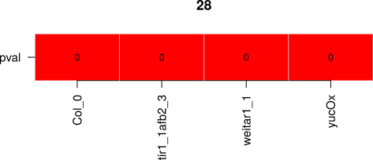
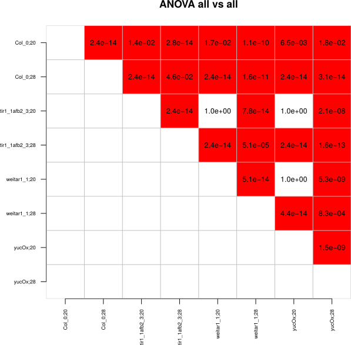
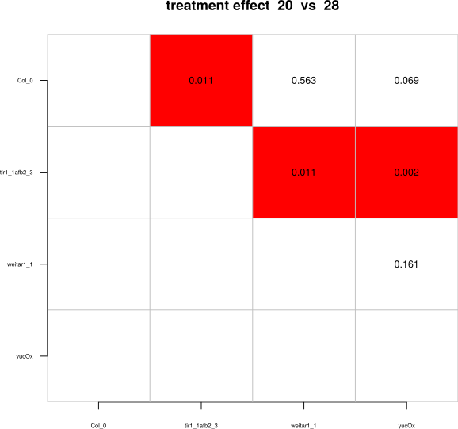
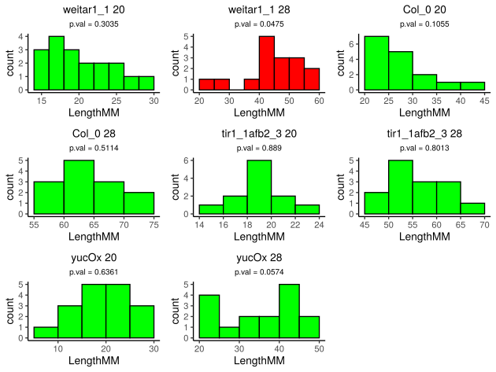

```{r, include = FALSE}
knitr::opts_chunk$set(
  collapse = TRUE,
  comment = "#>",
  fig.width = 6,
  fig.height = 6
)
devtools::load_all(".")
```

Detailed (Advanced) manual for `rootdetectR 0.9.4`

# Table of Contents

1.  [Introduction](#introduction)
2.  [Installation](#installation)
3.  [Process Data](#data-processing)
4.  [Conduct Statistical Tests](#statistics)
5.  [Plots](#plot-data)
6.  [Additional Features](#additional-features)
7.  [Future Features](#future-features)

# Introduction {#introduction}

<<<<<<< HEAD
[RootDetection](http://www.labutils.de/) is an automated tool for
evaluating photographs of plant roots. It detects single strand roots,
traces their paths and measures the resulting lengths - completely
automatic. It can also be used to measure hypocotyl, petiole length and
other parameters by hand. All results are written to an embedded
database and can be exported as \*.csv files.

The `rootdetectR` package provides useful functions in R to analyze the
\*.csv output from Rootdetection. With the provided functions it is
possible to conduct all necessary data processing (e.g. normalize data
according to length standard, compute relative data) and statistical
test (e.g. summary statistics, test for normal distribution, different
types of ANOVA analysis). Additionally it is possible to produce
publication ready data representation (box or jitter plots containing
statistic information) with the provided functions. This vignette is
showing the workflow for standard statistical analysis and data
representation with `rootdetectR`. The methods implemented in this
package were previously used for multiple publications (e.g. [Bellstaedt
et. al 2019](https://www.plantphysiol.org/content/180/2/757); [Ibañez
et. al
2018](https://www.sciencedirect.com/science/article/pii/S0960982217316020)
) .

To illustrate the standard analysis pipeline an example data set called
`root_output` (short for standard Rootdetection output) is included in
the package. If you call `root_output` you will find a data set
containing measured *Arabidopsis thaliana* wild-type (Col-0) and mutant
(tir1_1afb2_3, weitar1_1, yucOx) seedling roots at 20°C (hereafter also
called control) and 28°C (hereafter also called treatment). Plants were
grown on ATS plates for 4 days at 20°C and then stayed at 20°C or were
shifted to 28°C. The columns labeled with '10mm' contains the length
standard in column LengthPx (measured 10mm of a ruler for several times
with exact the same camera settings than for the rest of the pictures).

The `rootdetectR` package comes with another data set for some more
complex analysis. The data set called `root_output_multfac2` consists of
root measurements of *A. thaliana* plants (2 wild type strains and 2
mutants) grown under 3 different conditions on ATS plates: 8 days under
20°C, 8 days under 28°C and a shift experiment with 4 days 20°C and
subsequently 4 days under 28°C. The length standard of this experiment
is labeled with '20mm' and describes standard measurements of 20mm.
=======
[RootDetection](http://www.labutils.de/) is an automated tool for evaluating photographs of plant roots. It detects single strand roots, traces their paths and measures the resulting lengths - completely automatic. It can also be used to measure hypocotyl, petiole length and other parameters by hand. All results are written to an embedded database and can be exported as \*.csv files.

The `rootdetectR` package provides useful functions in R to analyze the \*.csv output from Rootdetection. With the provided functions it is possible to conduct all necessary data processing (e.g. normalize data according to length standard, compute relative data) and statistical test (e.g. summary statistics, test for normal distribution, different types of ANOVA analysis). Additionally it is possible to produce publication ready data representation (box or jitter plots containing statistic information) with the provided functions. This vignette is showing the workflow for standard statistical analysis and data representation with `rootdetectR`. The methods implemented in this package were previously used for multiple publications (e.g. [Bellstaedt et. al 2019](https://www.plantphysiol.org/content/180/2/757); [Ibañez et. al 2018](https://www.sciencedirect.com/science/article/pii/S0960982217316020) ) .

To illustrate the standard analysis pipeline an example data set called `root_output` (short for standard Rootdetection output) is included in the package. If you call `root_output` you will find a data set containing measured *Arabidopsis thaliana* wild-type (Col-0) and mutant (tir1_1afb2_3, weitar1_1, yucOx) seedling roots at 20°C (hereafter also called control) and 28°C (hereafter also called treatment). Plants were grown on ATS plates for 4 days at 20°C and then stayed at 20°C or were shifted to 28°C. The columns labeled with '10mm' contains the length standard in column LengthPx (measured 10mm of a ruler for several times with exact the same camera settings than for the rest of the pictures).

The `rootdetectR` package comes with another data set for some more complex analysis. The data set called `root_output_multfac2` consists of root measurements of *A. thaliana* plants (2 wild type strains and 2 mutants) grown under 3 different conditions on ATS plates: 8 days under 20°C, 8 days under 28°C and a shift experiment with 4 days 20°C and subsequently 4 days under 28°C. The length standard of this experiment is labeled with '20mm' and describes standard measurements of 20mm.
>>>>>>> 77515d9093ecf96b6d7d53f196f9048a1ae36b3c

# Installation {#installation}

Make sure you have the latest version of R and R Studio.

<<<<<<< HEAD
**Caution:** Windows user will need to install
[RTools](cran.r-project.org/bin/windows/Rtools/) to be able to build the
package.
=======
**Caution:** Windows user will need to install [RTools](cran.r-project.org/bin/windows/Rtools/) to be able to build the package.
>>>>>>> 77515d9093ecf96b6d7d53f196f9048a1ae36b3c

To build the vignette (this detailed manual) on you computer you will
need to install the packages knitr and rmarkdown.

``` r
install.packages(c('knitr', 'rmarkdown'))
```

To install rootdetectR from github the package devtools is required.

``` r
# devtools needs to be available to download packages from github
if('devtools' %in% rownames(installed.packages()) == FALSE) {install.packages('devtools')}
library('devtools')
```

After installing all prerequisites you can install `rootdetectR` from
github.

``` r
# install from github
install_github("PhilippJanitza/rootdetectR", build_vignettes = TRUE)
```

After the installation the package can be loaded within R.

```{r}
library(rootdetectR)
```

To view the vignette in R type:

``` r
# Advanced and Detailed Documentation
vignette('Advanced_Introduction', package = 'rootdetectR')

# Short Introduction
vignette('Short_Introduction', package = 'rootdetectR')
```

# Data Processing {#data-processing}

## Check Raw Data

<<<<<<< HEAD
The package comes with an example data set to illustrates the structure
of an \*.csv output file from Rootdetection. Make sure your data set is
matching all the criteria needed for the package.
=======
The package comes with an example data set to illustrates the structure of an \*.csv output file from Rootdetection. Make sure your data set is matching all the criteria needed for the package.
>>>>>>> 77515d9093ecf96b6d7d53f196f9048a1ae36b3c

```{r}
# load example data set stored in rootdetectR
data("root_output")

# show an example Rootdetection output
head(root_output)
```

<<<<<<< HEAD
To test if your Rootdetection Output has the right format you can use
the function `is_rootdetection_output`. Several conditions must be
fulfilled to be a data set that can be handled by `rootdetectR`. The
data must be in a data.frame containing at least following columns:
Label, LenghtPx and LengthMM. The column names must be exactly the same
as in the example (check cases). The column LengthPx must contain
numerical values and the Label '10mm' must be present to calculate the
length values in mm (LengthMM). If the length standard is not labeld as
'10mm' it is possible to provide the name of the length standard by
setting `length_standard`.
=======
To test if your Rootdetection Output has the right format you can use the function `is_rootdetection_output`. Several conditions must be fulfilled to be a data set that can be handled by `rootdetectR`. The data must be in a data.frame containing at least following columns: Label, LenghtPx and LengthMM. The column names must be exactly the same as in the example (check cases). The column LengthPx must contain numerical values and the Label '10mm' must be present to calculate the length values in mm (LengthMM). If the length standard is not labeld as '10mm' it is possible to provide the name of the length standard by setting `length_standard`.
>>>>>>> 77515d9093ecf96b6d7d53f196f9048a1ae36b3c

```{r}
# this input dataset follows all the standards
is_root_output(root_output)
```

<<<<<<< HEAD
The function returns a logical variable. If R prints TRUE your input
data set follows all the Rootdetection Output standards.
=======
The function returns a logical variable. If R prints TRUE your input data set follows all the Rootdetection Output standards.
>>>>>>> 77515d9093ecf96b6d7d53f196f9048a1ae36b3c

## Calculate LengthMM according to 10mm standard

In standard Rootdetection Assays you should include some standard
measurements defined by the label 10mm. The function
`norm_10mm_standard` is using the LengthPx values from the label '10mm'
to calculate a length standard. This standard is used to calculate
LengthMM for all lines and afterwards the 10mm standard is deleted from
the data table. In addition the label is split into Factor1 and Factor2
by `label_delim`. This normalization and splitting procedure must be
done with every assay since camera focus and settings will change
between different experiments. For all following functions you will need
the output (Normalized Rootdetection Output) from this function. In
addition it is possible to avoid the splitting of the label by setting
`split = FALSE`.

```{r}
# calculate LengthMM for all lines
root_norm <- norm_10mm_standard(root_output, label_delim = ";")

head(root_norm)
```

## Calculate LengthMM according to customized standard

If you want to add a customized length standard (different from 10mm
standard described above) you can use the function `norm_cust_standard`.
In addition to the function `norm_10mm_standard` you are able to change
the label and the mm length described by this standard measurements.
Here the data set `root_norm_multfac2` is used to illustrate this
function.

```{r}
# calculate LengthMM for all lines
root_norm_multfac2 <- norm_cust_standard(root_output_multfac2,
  label_delim = ";",
  label_standard = "20mm", standard_length_mm = "20"
)

head(root_norm_multfac2)
```

<<<<<<< HEAD
In addition it is possible to adjust the column names of the combined
grouping variable (standard = Label) by setting `col_label` and the
dependent variable (standard = LengthPx) by setting `col_value`.
=======
In addition it is possible to adjust the column names of the combined grouping variable (standard = Label) by setting `col_label` and the dependent variable (standard = LengthPx) by setting `col_value`.
>>>>>>> 77515d9093ecf96b6d7d53f196f9048a1ae36b3c

## Check Normalized Data

Analogous to the `is_root_output` function there is a function to check
length standard normalized data sets for fulfilling the criteria for
following data processing and analysis. Therefore the data must be in a
data.frame containing at least following columns: Label and LengthMM.
The column names must be exactly the same as in the example (check
cases). The column LengthMM must contain numerical values and the length
standard must not be present.

```{r}
# calculate LengthMM for all lines
root_norm <- norm_10mm_standard(root_output, label_delim = ";")

is_root_norm(root_norm)
```

The function returns a logical variable. If R prints TRUE your input
data set follows all the standards of a normalized Rootdetection data
set.

<<<<<<< HEAD
In addition to the `is_root_norm` function there is the possibility to
plot an overview of the dataset with the `inspect_root_norm` function.
Using this function you will get an data representation as plot and/or
text output. This function can be very helpful to find mistakes in the
labeling or Factor1 Factor2 combinations with not enough replicates when
using larger data sets.
=======
In addition to the `is_root_norm` function there is the possibility to plot an overview of the dataset with the `inspect_root_norm` function. Using this function you will get an data representation as plot and/or text output. This function can be very helpful to find mistakes in the labeling or Factor1 Factor2 combinations with not enough replicates when using larger data sets.
>>>>>>> 77515d9093ecf96b6d7d53f196f9048a1ae36b3c

```{r}
# get an overview of the input data set
inspect_root_norm(root_norm)
```

<<<<<<< HEAD
As output a matrix with all Factor1 Factor2 combinations will be
plotted. The plotted numbers represent the number of replicates present.
All Factor1 Factor2 combinations with n \> 10 will be printed in green
and become the lable good quality. If the number of replicates (n) is
between 5 and 10 the combination will be printed in yellow and marked
with the quality score fair. All combinations with n \< 5 and missing
data (n = 0) will be represented in red and marked as bad quality.

## Calculate Relative Data

Relative data describes the change between control and treatment of
grouping variable 2 (Factor2). For each grouping variable 1 (Factor1)
the treatment values are set in relation to the median of the control.
First for each grouping variable 1 (Factor1) the median of the control
(20°C) measurements is calculated. This median is then used to calculate
values of the treatment (28°C) relative to the control (20°C) median by
this formula: <br><br>

$relativevalue = \displaystyle \frac{100 * treatmentvalue}{control median}$

<br> The function `rel_data` returns a data.frame containing relative
values for each line and each treatment (control values are not present
anymore!).
=======
As output a matrix with all Factor1 Factor2 combinations will be plotted. The plotted numbers represent the number of replicates present. All Factor1 Factor2 combinations with n \> 10 will be printed in green and become the lable good quality. If the number of replicates (n) is between 5 and 10 the combination will be printed in yellow and marked with the quality score fair. All combinations with n \< 5 and missing data (n = 0) will be represented in red and marked as bad quality.

## Calculate Relative Data

Relative data describes the change between control and treatment of grouping variable 2 (Factor2). For each grouping variable 1 (Factor1) the treatment values are set in relation to the median of the control. First for each grouping variable 1 (Factor1) the median of the control (20°C) measurements is calculated. This median is then used to calculate values of the treatment (28°C) relative to the control (20°C) median by this formula: <br><br>

$relativevalue = \displaystyle \frac{100 * treatmentvalue}{control median}$

<br> The function `rel_data` returns a data.frame containing relative values for each line and each treatment (control values are not present anymore!).
>>>>>>> 77515d9093ecf96b6d7d53f196f9048a1ae36b3c

```{r}
rel_table <- rel_data(root_norm, control = "20")
head(rel_table)
```

# Statistics {#statistics}

## Calculating Summary Statistics

To get an overview of the data it is good to check some general
statistical parameters. The function `summary_stat` calculates sample
size (n), median, mean, standard deviation (sd) and standard error (se)
for all levels of both grouping variables (Factor1 and Factor2) present
in the Normalized Rootdetection Output.

```{r}
# calculate summary statistic for each line
sum_s <- summary_stat(root_norm)
sum_s
```

<<<<<<< HEAD
It is possible to use the function with non Rootdetection data sets by
adjusting the arguments `col_grouping` to set column names of the
grouping variables and `col_value` to set the column name of the
dependent variable.

## Test for normality

Like other parametric tests, the analysis of variance (ANOVA) assumes
that the data fit a normal distribution. If your measurement variable is
not normally distributed, you may increase the chance of false positive
results if you analyze the data with an ANOVA or other parametric tests.
Therefore the `rootdetectR` package contains a function to test if the
measurements of all lines under each condition are normally distributed.
The `normality_test` function takes a Normalized Rootdetection Output
data.frame as input and conducts a Shapiro-Wilk test of normality for
each grouping variable 1 (Factor1) grouping variable 2 (Factor2)
combination. The function returns a data.frame containing p-values. The
null-hypothesis of this test is that the population is normally
distributed. If the p value is less than 0.05 (alpha level), then the
null hypothesis is rejected and there is evidence that the data is not
normally distributed. If the p value is greater than 0.05 the null
hypothesis that the data came from a normally distributed population can
not be rejected. (p \< 0.05 --\> evidence that not normally distributed
\| p \> 0.05 --\> evidence that normally distributed)
=======
It is possible to use the function with non Rootdetection data sets by adjusting the arguments `col_grouping` to set column names of the grouping variables and `col_value` to set the column name of the dependent variable.

## Test for normality

Like other parametric tests, the analysis of variance (ANOVA) assumes that the data fit a normal distribution. If your measurement variable is not normally distributed, you may increase the chance of false positive results if you analyze the data with an ANOVA or other parametric tests. Therefore the `rootdetectR` package contains a function to test if the measurements of all lines under each condition are normally distributed. The `normality_test` function takes a Normalized Rootdetection Output data.frame as input and conducts a Shapiro-Wilk test of normality for each grouping variable 1 (Factor1) grouping variable 2 (Factor2) combination. The function returns a data.frame containing p-values. The null-hypothesis of this test is that the population is normally distributed. If the p value is less than 0.05 (alpha level), then the null hypothesis is rejected and there is evidence that the data is not normally distributed. If the p value is greater than 0.05 the null hypothesis that the data came from a normally distributed population can not be rejected. (p \< 0.05 --\> evidence that not normally distributed \| p \> 0.05 --\> evidence that normally distributed)
>>>>>>> 77515d9093ecf96b6d7d53f196f9048a1ae36b3c

```{r}
check_norm <- normality_test(root_norm)
check_norm
```

It is possible to use the function with non Rootdetection data sets by
adjusting the arguments `col_grouping` and `col_value` for column names
storing grouping and dependent variables.

<<<<<<< HEAD
In addition `rootdetectR` has a function called `plot_hist`. This
function produces histogram plots for each line (Factor1) and condition
(Factor2) containing the values from this group wise Shapiro-Wilk test.
For more information on this check the [Plots](#plot-data) section.

=======
>>>>>>> 77515d9093ecf96b6d7d53f196f9048a1ae36b3c
## One-Way ANOVA

The are different kinds of ANOVA (Analysis of Variance) implemented in
`rootdetectR` to have useful tools to reassess different comparisons of
your data set. A good starting point is to conduct One-Way ANOVA
analysis for Factor1 and Factor2 to check if there are differences
within this factors. `rootdetectR` comes with two functions
(`onefacaov_fac1` and `onefacaov_fac2`) to do this kind of analysis. The
output is a matrix or a list of matrices with p-values from Tukey
post-hoc test.

<<<<<<< HEAD
`onefacaov_fac1` compares all grouping variable 1 (Factor1) within each
grouping variable 2 (Factor1). For every grouping variable 2 (Factor2) a
One-Way ANOVA is conducted over all measurements for each grouping
variable 1 (Factor1). Subsequently a Tukey post-hoc test is done and the
p-values are returned. For the example data you will retrieve a list of
two data.frames - one for each Factor2 condition (one for 20°C and one
for 28°C). In addition to the list of matrices output you can use the
function to produce a \*.pdf output of each matrix a plot with p-values
is produced (comparisons in red have a p-value \< 0.5 and are defined as
significant).
=======
`onefacaov_fac1` compares all grouping variable 1 (Factor1) within each grouping variable 2 (Factor1). For every grouping variable 2 (Factor2) a One-Way ANOVA is conducted over all measurements for each grouping variable 1 (Factor1). Subsequently a Tukey post-hoc test is done and the p-values are returned. For the example data you will retrieve a list of two data.frames - one for each Factor2 condition (one for 20°C and one for 28°C). In addition to the list of matrices output you can use the function to produce a \*.pdf output of each matrix a plot with p-values is produced (comparisons in red have a p-value \< 0.5 and are defined as significant).
>>>>>>> 77515d9093ecf96b6d7d53f196f9048a1ae36b3c

```{r}
# draw_out = F produces only a list of matrices containing p-values from Tukey post-hoc test
ow_anova_factor1 <- onefacaov_fac1(root_norm, draw_out = F)
ow_anova_factor1
```

<<<<<<< HEAD
<br> The `file_base` argument is necessary if `draw_out = T`. It is used
to get the path and the base for the file name (e.g.
/your/path/filebasename). Two \*.pdf files were produced in this example
case as we have two Factor2 levels. The functions adds the level of
grouping variable 2 (Factor2) automatically to the file names. In this
example case the file names will be 1fac_ANOVA_factor1_20.pdf and
1fac_ANOVA_factor1_28.pdf.
=======
<br> The `file_base` argument is necessary if `draw_out = T`. It is used to get the path and the base for the file name (e.g. /your/path/filebasename). Two \*.pdf files were produced in this example case as we have two Factor2 levels. The functions adds the level of grouping variable 2 (Factor2) automatically to the file names. In this example case the file names will be 1fac_ANOVA_factor1_20.pdf and 1fac_ANOVA_factor1_28.pdf.
>>>>>>> 77515d9093ecf96b6d7d53f196f9048a1ae36b3c

``` r
# draw_out = T produces a list of matrices containing p-values from Tukey post-hoc test 
# in addition pdf files with basename 1fac_ANOVA_factor1 are produced in your working dir
ow_anova_factor1 <- onefacaov_fac1(root_norm, draw_out = T, file_base = '1fac_ANOVA_factor1')
# the argument p_value_size changes the sizes of the plotted p-value
ow_anova_factor1 <- onefacaov_fac1(root_norm, draw_out = T, file_base = '1fac_ANOVA_factor1', 
                                   p_value_size = 0.8)
```

<br><br>

<center>

 <br>

<p style="font-size:12px;">

1fac_ANOVA_factor1_20.pdf

</p>

<br><br>  <br>

<p style="font-size:12px;">

1fac_ANOVA_factor1_28.pdf

</p>

<br><br>

</center>

<<<<<<< HEAD
`onefacaov_fac2` compares grouping variable 2 (Factor2) control (20°C)
to each grouping variable 2 (Factor2 treatment) (in this example there
is only one treatment - 28°C) for each grouping variable 1 (Factor1).
For each grouping variable 1 (Factor1) a One-Way ANOVA is conducted for
each grouping variable 2 (Factor2) control (20°C) treatment (28°C)
combination. This function will return matrices for each control
treatment combination. In addition to the list of matrices you can use
the function to produce a \*.pdf output of each matrix containing a plot
with p-values from Tukey post-hoc test (comparisons in red have a
p-value \< 0.5 and are defined as significant).
=======
`onefacaov_fac2` compares grouping variable 2 (Factor2) control (20°C) to each grouping variable 2 (Factor2 treatment) (in this example there is only one treatment - 28°C) for each grouping variable 1 (Factor1). For each grouping variable 1 (Factor1) a One-Way ANOVA is conducted for each grouping variable 2 (Factor2) control (20°C) treatment (28°C) combination. This function will return matrices for each control treatment combination. In addition to the list of matrices you can use the function to produce a \*.pdf output of each matrix containing a plot with p-values from Tukey post-hoc test (comparisons in red have a p-value \< 0.5 and are defined as significant).
>>>>>>> 77515d9093ecf96b6d7d53f196f9048a1ae36b3c

```{r}
# draw_out = F produces a list of matrices containing p-values from Tukey post-hoc test
# in addition you need to tell the function the name of the control
# make sure that the control value is exactly the same as in column Factor2
ow_anova_factor2 <- onefacaov_fac2(root_norm, control = "20", draw_out = F)
ow_anova_factor2
```

<br>

<<<<<<< HEAD
The `file_base` argument is necessary if `draw_out = T`. It is used to
get the path and the base for the file name (e.g.
/your/path/filebasename). In this example case there is only one
treatment condition (28°C) so a single \*.pdf file
(1fac_ANOVA_factor2_28.pdf) is created.
=======
The `file_base` argument is necessary if `draw_out = T`. It is used to get the path and the base for the file name (e.g. /your/path/filebasename). In this example case there is only one treatment condition (28°C) so a single \*.pdf file (1fac_ANOVA_factor2_28.pdf) is created.
>>>>>>> 77515d9093ecf96b6d7d53f196f9048a1ae36b3c

``` r
# draw_out = T produces a list of data.frames containing p-values from Tukey post-hoc test
# in addition pdf files with basename 1fac_ANOVA_factor1 are produced in your working dir
ow_anova_factor2 <- onefacaov_fac2(root_norm, control = '20', draw_out = T, 
                                   file_base = '1fac_ANOVA_factor2')
# the argument p_value_size changes the sizes of the plotted p-value
ow_anova_factor2 <- onefacaov_fac2(root_norm, control = '20', draw_out = T, 
                                   file_base = '1fac_ANOVA_factor2', p_value_size = 0.8)
```

<br><br>

<center>

 <br>

<p style="font-size:12px;">

1fac_ANOVA_factor2_28.pdf

</p>

<br><br>

</center>

<<<<<<< HEAD
It is possible to use the function with non Rootdetection data sets by
adjusting some arguments of the functions. The Arguments `col_grouping1`
and `col_grouping2` can be used to set the column names of two grouping
variables and `col_value` to set the column name of dependent variable.
=======
It is possible to use the function with non Rootdetection data sets by adjusting some arguments of the functions. The Arguments `col_grouping1` and `col_grouping2` can be used to set the column names of two grouping variables and `col_value` to set the column name of dependent variable.
>>>>>>> 77515d9093ecf96b6d7d53f196f9048a1ae36b3c

## Two-Way ANOVA

To compare all lines and all conditions among each other a Two-Way ANOVA
is a suitable statistical analysis. The function `twofacaov` implemented
in `rootdetectR` is able to compare all lines from a Normalized
Rootdetection Output by a Two-Way ANOVA and a Tukey post-hoc test. The
function will return a matrix containing p-values for all comparisons.
Values obtained from this analysis are used as input to print statistics
in plots of the absolute data (`abs_plot` function). For more
information check the [Plots](#plot-data) section.

```{r}
# draw_out = F produces a matrix containing p-values from Tukey post-hoc test
# label_delim defines how Factor1 and Factor 2 are splitted in column Label

tw_anova <- twofacaov(root_norm, label_delim = ";", draw_out = F)
tw_anova
```

<<<<<<< HEAD
<br> The `file` argument is necessary if `draw_out = T` is used to have
a path and the file name.( **Caution:** For this function you have to
type the whole file name (ending with '.pdf') and not just a base name)
In the following example a \*.pdf file with the name
2fac_ANOVA_all_vs_all.pdf is printed.
=======
<br> The `file` argument is necessary if `draw_out = T` is used to have a path and the file name.( **Caution:** For this function you have to type the whole file name (ending with '.pdf') and not just a base name) In the following example a \*.pdf file with the name 2fac_ANOVA_all_vs_all.pdf is printed.
>>>>>>> 77515d9093ecf96b6d7d53f196f9048a1ae36b3c

``` r
# draw_out = T produces a matrix containing p-values from Tukey post-hoc test
# in addition pdf files with basename 1fac_ANOVA_factor1 are produced in the working dir
tw_anova <- twofacaov(root_norm, label_delim = ';', draw_out = T, 
                                   file = '2fac_ANOVA_all_vs_all.pdf')
# the argument p_value_size changes the sizes of the plotted p-value
tw_anova <- twofacaov(root_norm, label_delim = ';', draw_out = T, 
                                   file = '2fac_ANOVA_all_vs_all.pdf',
                                   p_value_size = 0.8)
```

<br><br>

<center>

 <br>

<p style="font-size:12px;">

2fac_ANOVA_all_vs_all.pdf

</p>

<br><br>

</center>

<<<<<<< HEAD
As described for one-way ANOVA analysis the function `twofacaov` can be
used for non Rootdetection standard data sets by setting
`col_grouping1`, `col_grouping2` and `col_value`. In addition it is
possible to add ANOVA summary plots to the generated pdf files by
setting `summary_plots = TRUE`.
=======
As described for one-way ANOVA analysis the function `twofacaov` can be used for non Rootdetection standard data sets by setting `col_grouping1`, `col_grouping2` and `col_value`. In addition it is possible to add ANOVA summary plots to the generated pdf files by setting `summary_plots = TRUE`.
>>>>>>> 77515d9093ecf96b6d7d53f196f9048a1ae36b3c

## pairwise Two-Way ANOVA of treatment responses (interaction effects)

To compare the change from grouping variable 2 (Factor2) control (here
20°C) to each treatment (here only 28°C) for each grouping variable 1
(Factor1) a pairwise Two-Way ANOVA of treatment responses is conducted.
Afterwards a Tukey post-hoc test is done and p-values are adjusted for
multiple testing by Benjamini-Hochberg correction. For each grouping
variable 2 control treatment combination a matrix containing p-values is
returned. The adjusted p-values from this analysis are used to print
statistics in the relative plots (`plot_rel` function). For more
information check the [Plots](#plot-data) section.

```{r}
# draw_out = F produces a matrix containing p-values from Tukey post-hoc test
# label_delim defines how Factor1 and Factor 2 are splitted in column Label
# in addition you need to tell the function the name of the control
interaction_tw_anova <- interaction_twofacaov(root_norm,
  control = "20", label_delim = ";",
  draw_out = F
)
interaction_tw_anova
```

<<<<<<< HEAD
<br> The `file_base` argument is necessary if `draw_out = T` is used to
have a path and the base for the file name. For each Factor2 control
(20°C) Factor2 treatment (28°C) pair a \*.pdf file is created.
=======
<br> The `file_base` argument is necessary if `draw_out = T` is used to have a path and the base for the file name. For each Factor2 control (20°C) Factor2 treatment (28°C) pair a \*.pdf file is created.
>>>>>>> 77515d9093ecf96b6d7d53f196f9048a1ae36b3c

``` r
# draw_out = F produces a matrix containing p-values from Tukey post-hoc test
#
#
# label_delim defines how Factor1 and Factor 2 are splitted in column Label
# in addition you need to tell the function the name of the control
interaction_tw_anova <- interaction_twofacaov(root_norm, control = "20", label_delim = ';', 
                                      draw_out = T, file_base = '2fac_ANOVA_BH_corrected')
# the argument p_value_size changes the sizes of the plotted p-value
interaction_tw_anova <- interaction_twofacaov(root_norm, control = "20", label_delim = ';', 
                                      draw_out = T, file_base = '2fac_ANOVA_BH_corrected'
                                      p_value_size = 0.8)
```

<br><br>

<center>

 <br>

<p style="font-size:12px;">

2fac_ANOVA_BH_corrected_20_vs_28.pdf

</p>

<br><br>

</center>

<<<<<<< HEAD
Also this ANOVA analysis can be used with non Rootdetection data sets by
adjusting `col_grouping1`, `col_grouping2` and `col_value` to define
grouping and dependent variables. *Caution: For the
`interaction_twofacaov` it is NOT possible to generate summary plots.*

# Plot data {#plot-data}

To visualize the data obtained from Rootdetection the `rootdetectR`
package comes with several plot features to produce publication ready
data visualization using the `ggplot2` package. The plot functions of
`rootdetectR` are also able to illustrate significance among several
lines within the plot using a Letter code.

## Histogram plots

To visualize the distribution of the data the function `plot_hist` will
produce an histogram for each line, show the p-values of a Shapiro-Wilk
test and adds color encoding (green - likely normally distributed \|
red - likely not normally distributed) to the plot.
=======
Also this ANOVA analysis can be used with non Rootdetection data sets by adjusting `col_grouping1`, `col_grouping2` and `col_value` to define grouping and dependent variables. *Caution: For the `interaction_twofacaov` it is NOT possible to generate summary plots.*

# Plot data {#plot-data}

To visualize the data obtained from Rootdetection the `rootdetectR` package comes with several plot features to produce publication ready data visualization using the `ggplot2` package. The plot functions of `rootdetectR` are also able to illustrate significance among several lines within the plot using a Letter code.

## Histogram plots

To visualize the distribution of the data the function `plot_hist` will produce an histogram for each line, show the p-values of a Shapiro-Wilk test and adds color encoding (green - likely normally distributed \| red - likely not normally distributed) to the plot.
>>>>>>> 77515d9093ecf96b6d7d53f196f9048a1ae36b3c

The function will produce a list of plots containing a histogram for
each line.

```{r}
# this will produce a list of plots
histograms <- plot_hist(root_norm, draw_out = F)
# For each line under each condition a plot will be produced
length(histograms)
# you can acess e.g. the first plot by typing:
histograms[[1]]
```

<<<<<<< HEAD
In addition you can print the plots in a single \*.pdf file by setting
`draw_out = T` and choose a path and a file name with the `file`
argument. This will print out up to 12 plots per page.
=======
In addition you can print the plots in a single \*.pdf file by setting `draw_out = T` and choose a path and a file name with the `file` argument. This will print out up to 12 plots per page.
>>>>>>> 77515d9093ecf96b6d7d53f196f9048a1ae36b3c

``` r
plot_hist(root_norm, draw_out = T, file = 'data_distribution.pdf')
```

<br><br>

<center>

 <br>

<p style="font-size:12px;">

histograms.pdf

</p>

</center>

## Plot absolute data

<<<<<<< HEAD
To visualize the absolute data there is the function `plot_abs`
implemented in `rootdetectR`. This function will produce a box, jitter
or violin plot containing measurements of each line (Factor1) under each
condition (Factor2) using `ggplot2`. There are some features (arguments)
to customize the plots to your needs. This manual will tackle only some
very basic customization parameters. For more information on
customization of legend elements, axes elements, plotting of sample
size, letter elements etc. just check out the man file by typing
`?plot_abs` after loading the package.
=======
To visualize the absolute data there is the function `plot_abs` implemented in `rootdetectR`. This function will produce a box, jitter or violin plot containing measurements of each line (Factor1) under each condition (Factor2) using `ggplot2`. There are some features (arguments) to customize the plots to your needs. This manual will tackle only some very basic customization parameters. For more information on customization of legend elements, axes elements, plotting of sample size, letter elements etc. just check out the man file by typing `?plot_abs` after loading the package.
>>>>>>> 77515d9093ecf96b6d7d53f196f9048a1ae36b3c

```{r}
# plot absolute data as box plot
absolute_plot <- plot_abs(root_norm, plot_significance = F, label_delim = ";", type = "box")
absolute_plot
```

```{r}
# plot absolute data as combination of box plot and jitter plot
absolute_plot <- plot_abs(root_norm, plot_significance = F, label_delim = ";", type = "jitter")
absolute_plot
```

```{r}
# plot absolute data as violin plot
absolute_plot <- plot_abs(root_norm, plot_significance = F, label_delim = ";", type = "violin")
absolute_plot
```

<<<<<<< HEAD
It is possible to change the color of box, jitter or violin plot by
using the argument `plot_colours`. To change the colors you have to add
a vector with colors (`ggplot2` colors or hex colors) matching the same
length than Factor2 factors. To find out more about using colors in
`ggplot2` check: [sape
Homepage](https://www.sape.inf.usi.ch/quick-reference/ggplot2/colour) If
you don't add a vector with colors the function will use the standard
`ggplot2` colors.
=======
It is possible to change the color of box, jitter or violin plot by using the argument `plot_colours`. To change the colors you have to add a vector with colors (`ggplot2` colors or hex colors) matching the same length than Factor2 factors. If you don't add a vector with colors the function will use the standard `ggplot2` colors.
>>>>>>> 77515d9093ecf96b6d7d53f196f9048a1ae36b3c

```{r}
# first check the quantity of Factor2 conditions
length(unique(root_norm$Factor2))
# add a vector with two colours to your data
absolute_plot <- plot_abs(root_norm,
  plot_significance = F, label_delim = ";", type = "jitter",
  plot_colours = c("blue", "red")
)
absolute_plot
```

With `rootdetectR` it is possible to add statistics to this plots using
Letter encoding by setting `plot_significance` to TRUE. Therefore the
function twofacaov is run internally.

```{r}
# use the twofacaov in the plotting function to plot statistics
absolute_plot <- plot_abs(root_norm,
  plot_significance = T, label_delim = ";",
  type = "jitter", plot_colours = c("blue", "red")
)
absolute_plot
```

As you can see in the output it seems like the letters are sticking
directly onto the highest data point. You can adjust this by using the
argument `height_letter`. By default it is set to 2. This means the
Letters will be added 2 'x-values' above the highest data point. For
this data set we need to increase the letter height.

```{r}
# increase letter heigth
absolute_plot <- plot_abs(root_norm,
  plot_significance = T, label_delim = ";",
  type = "jitter", plot_colours = c("blue", "red"),
  height_letter = 5
)
absolute_plot
```

<<<<<<< HEAD
To visualize the impact of Factor2 treatment it is possible to draw a
vertical line between the median of two boxes. *Caution:* With the
current rootdetectR Version it is only possible if there are two Factor2
conditions. If you have more than two Factor2 conditions you will get an
error message.
=======
To visualize the impact of Factor2 treatment it is possible to draw a vertical line between the median of two boxes. *Caution:* With the current rootdetectR Version it is only possible if there are two Factor2 conditions. If you have more than two Factor2 conditions you will get an error message.
>>>>>>> 77515d9093ecf96b6d7d53f196f9048a1ae36b3c

```{r}
# plot rersponse behaviour
absolute_plot <- plot_abs(root_norm,
  plot_significance = F,
  plot_response = T
)
absolute_plot
```

## Plot relative data

Analogous to the plots of the absolute date `rootdetectR` comes with a
function to plot relative data called `plot_rel`. For this function it
is also possible to plot letter encoded statistics by setting
`plot_significance` to TRUE. Since the `interaction_twofacaov` is only
capable to compare relative data for each Factor2 control Factor2
treatment pair you will obtain multiple plots if you have more than one
Factor2 treatment (more than two Factor2 in general). (If you have
multiple Factor2 treatments and set plot_significance = F you will get
all the data in one plot without statistics.)

<<<<<<< HEAD
*Caution: The input data set is the Normalized Root Output and not the
table with relative data.* The relative data is calculated within the
function
*Caution: The input data set is the Normalized Root Output and not the table with relative data.* 

```{r}
# plot relative data
relative_plot <- plot_rel(root_norm, plot_significance = F, type = "jitter", control = "20")
relative_plot
```

To add statistics to this plot set `plot_significance = T`. The pairwise
ANOVA of interaction effects (interaction_twofacaov) is run internally.

```{r}
# plot relative data with statistics
relative_plot <- plot_rel(root_norm,
  plot_significance = T,
  type = "jitter", control = "20", height_letter = 10
)
relative_plot
```

The paragraph illustrates the behavior of the `plot_rel` function if you
have a data set containing multiple Factor2 treatment levels. Therefore
the data set `root_output_multfac2` is used in the next examples.

```{r}
# first we need to normalize the dataset with length standard
# (Caution: customized length standard used)
root_norm_multfac2 <- norm_cust_standard(root_output_multfac2,
  label_delim = ";",
  label_standard = "20mm", standard_length_mm = "20"
)

# plot relative data with multiple factor2 treatment levels without statistics
relative_plot_multfac2 <- plot_rel(root_norm_multfac2,
  plot_significance = F,
  type = "jitter", control = "20", height_letter = 10
)
relative_plot_multfac2
```

Although we have multiple Factor2 treatment levels in this example all
the data is plotted together as long as we use `plot_significance = F`.
If you want to plot relative data of single Factor2 treatments without
statistics you need to subset your data using the `subset_fac2()`
function described in the section [Additional
Features](#additional-features).

```{r}
# first we need to normalize the dataset with length standard
# (Caution: customized length standard used)
root_norm_multfac2 <- norm_cust_standard(root_output_multfac2,
  label_delim = ";",
  label_standard = "20mm", standard_length_mm = "20"
)


# plot relative data with multiple factor2 treatment levels with statistics
relative_plot_multfac2 <- plot_rel(root_norm_multfac2,
  plot_significance = T,
  type = "jitter", control = "20", height_letter = 10
)
# calling the variable will show us that there is a list with two plots
relative_plot_multfac2
```

<br> As we have two Factor2 treatments there are two plots are produced
with `plot_rel` and `plot_significance = T`.

There are some additional features (arguments) to customize the plots to
your needs. For more information on customization of legend elements,
axes elements, plotting of sample size, letter elements, coloring etc.
just check out the man file by typing `?plot_rel` after loading the
package.


# Additional Features {#additional-features}

The package `rootdetectR` comes with a number of additional useful functions to work with Rootdetection Outputs and other physiological measurements.


## Calculate Standard Error

The R base do not contain a function to calculate standard error.
Therefore `rootdetectR` has the function `se` implemented to calculate
the standard error of a numeric vector. The function `se` is used in
`summary_stat`.

```{r}
# get measurments for a single line and condition from Normalized Root Detection Output
# for this example we use root measurements Col-0 grown at 20°C
col0_20_measurments <- root_norm[root_norm$Label == "Col_0;20", ]$LengthMM
# calculate Standard Error
se(col0_20_measurments)
```

## Remove Outlier

Sometimes outliers indicate a mistake in data collection and can
influence the statistical power of a data set. In general it is not a
good practice to delete outlier from your data but form time to time you
might want to check the influence of outlier. Therefore the functions
`rm_outliers` and `rm_outliers_df` are added to `rootdetectR`. Within in
this functions outlier are defined as data points with more than 1.5 \*
IQR (interquartile range) from 75th and 25th percentiles. (defined as
outlier are data points (x) from a numeric vector that are: x \< Q1 -
1.5 \* IQR and x \> Q3 + 1.5 \* IQR)


Here is an example to explain the outlier detection in `rootdetectR`:

```{r}
# x is just an example vector
x <- c(82, 99, 100, 101, 103, 109, 110, 129)

# calculate and show quantiles
quantile(x)

# calculate 1.5 * IQR and store in variable
x_iqr <- (IQR(x, na.rm = T) * 1.5)
x_iqr

# calculate lower end Q1 - 1.5 * IQR
quantile(x, 0.25) - x_iqr
# calculate upper end Q3 + 1.5 * IQR
quantile(x, 0.75) + x_iqr

# so the first (82) and last (129) datapoint of x should be removed
```


<br> Here we calculated the upper and lower border of the 1.5 \* IQR and
could remove the first and last data point of x by hand. The function
`rm_outlier` can do this procedure for you.

```{r}
# you can use the rm_outlier function for this
rm_outlier(x)

# in addition you can convert the outlier to NA values to illustrate the position in your vector
# Caution: all NAs that were present in your dataset befor will automatically deleted
rm_outlier(x, fill_na = T)
```


<br> If you want to remove outliers from a complete Normalized Rootdetection Output you can use the function `rm_outlier_df`.

```{r}
# use rm_outlier_df function to delete all outliers from Normalized Rootdetection Output
head(rm_outlier_df(root_norm))

# you can convert the outlier to NA values to illustrate the positions in your data set
# Caution: all NAs that were present in your dataset befor will automatically deleted
head(rm_outlier_df(root_norm, fill_na = T))
```

<br>

## Create Subsets of Rootdetection Outputs by Factor2

Experiments with a lot of different conditions are quite common in
biological Assays. In such assays there is often a control condition and
different treatments (both Factor2) applied to a variety on lines
(Factor1). Some times these very big data sets are hard to handle and
plots will become quite messy. Therefore `rootdetectR` has implemented
the function `subset_fac2`. This function will create subsets for each
Factor2 control and treatment pair.

**Caution: If there is only a single treatment condition this type of
sub setting does not make any sense and the function will print an error
message.**

<<<<<<< HEAD
=======
**Caution: If there is only a single treatment condition this type of sub setting does not make any sense and the function will print an error message.**

>>>>>>> 77515d9093ecf96b6d7d53f196f9048a1ae36b3c
```{r}
# We can use the root_output_multfac2 dataset to subset our data
# this will produce a subset for eacht Factor2 control treatment pair
list_of_subsets <- subset_fac2(root_norm_multfac2, control = "20")

# this will produce a list of data.frames with the length of our control treatment pairs
# the names of the list elements correspond to Factor2 treatment name
head(list_of_subsets$`20_and_28`)
head(list_of_subsets$`20_and_20_28`)
```

<br>

## Use of colorblind friendly colors

<<<<<<< HEAD
About 8% of all males and 0.5% of all females have a color vision
deficiency. This is a decreased ability to see colors or differences in
colors. Therefore it is important to make sure that all readers of your
publications (or all people in the audience) can detect the different
colors in your plots. With `colors_wong` you can find a string
containing 7 colors in hex-format optimized for colorblind individuals.
The colors were proposed by Wong in following publication: [Wong, B.
(2011). Points of view: Color blindness. Nature Methods, 8(6),
441--441.](https://www.nature.com/articles/nmeth.1618)

`rootdetectR` comes with the function `show_colors` to visualize colors
stored in a string.
=======
About 8% of all males and 0.5% of all females have a color vision deficiency. This is a decreased ability to see colors or differences in colors. Therefore it is important to make sure that all readers of your publications (or all people in the audience) can detect the different colors in your plots. With `colors_wong` you can find a string containing 7 colors in hex-format optimized for colorblind individuals. The colors were proposed by Wong in following publication: [Wong, B. (2011). Points of view: Color blindness. Nature Methods, 8(6), 441--441.](https://www.nature.com/articles/nmeth.1618)

`rootdetectR` comes with the function `show_colors` to visualize colors stored in a string.
>>>>>>> 77515d9093ecf96b6d7d53f196f9048a1ae36b3c

```{r}
# colors_wong is a variable storing a string with hex-codes for 7 colourblind friendly
colors_wong

# to visualize the colours there is a function called show_colors
# this will plot all colours within in the strin colors_wong
show_colors(colors_wong)

# it is also possible to create strings with R colornames
example_colors <- c("red", "blue", "palegreen", "yellow3")
show_colors(example_colors)
```

## Extract colors from a picture

With the `extract_colors` function it is possible to extract the most
prominent colors of a given picture. Therefore picture must be present
in a raster array object. To read in picture files in the right format
you can use the `readJPEG` or `readPNG` function from the `jpeg` or
`png` package. As an example there is a raster array object included.
`primroses` stores a picture of prim roses from [Wikimedia
commons](https://upload.wikimedia.org/wikipedia/commons/thumb/6/6f/Primeln_bunte_Farbenpracht.JPG/1024px-Primeln_bunte_Farbenpracht.JPG).
With the function `extract_colors` it is possible to obtain the most
prominent colors of the picture by k-means clustering. By setting `n`
you define how many colors you want to obtain from the picture (default
= 6).

```{r}
# to be able to plot a picture you will need to load the grid package
library(grid)

grid.raster(primroses)
```

```{r}
# extract the 6 most prominent colors and store into a string
prim_colors <- extract_colors(primroses, n = 6)
# it is also possible to show the picture containing only the 6 extracted colors
# therefore you must set plot_out = T
prim_colors <- extract_colors(primroses, n = 6, plot_out = T)
# you can then use show_colors to plot the extracted colors
show_colors(prim_colors)
```

## Customized One-Way ANOVA with single grouping variable

<<<<<<< HEAD
It is possible to use the ANOVA functions of `rootdetectR` with
non-standard-rootdetection data tables. For all ANOVA functions
(`onefacaov_fac1`, `onefacaov_fac2`, `twofacaov`,
`interaction_twofacaov`) there is the possibility to adjust the columns
that contain grouping and depended variables. Just use the arguments
`grouping_var1`, `grouping_var2` and `dependend_var` and call the
columns containing the respective data. To conduct a simple one-way
ANOVA with `rootdetectR` you can use `onefacaov_fac1` and set the
`grouping_var2` to NULL.
=======
It is possible to use the ANOVA functions of `rootdetectR` with non-standard-rootdetection data tables. For all ANOVA functions (`onefacaov_fac1`, `onefacaov_fac2`, `twofacaov`, `interaction_twofacaov`) there is the possibility to adjust the columns that contain grouping and depended variables. Just use the arguments `grouping_var1`, `grouping_var2` and `dependend_var` and call the columns containing the respective data. To conduct a simple one-way ANOVA with `rootdetectR` you can use `onefacaov_fac1` and set the `grouping_var2` to NULL.
>>>>>>> 77515d9093ecf96b6d7d53f196f9048a1ae36b3c

```{r}
# create a dataset containing only a single grouping variable (Factor1)
root_norm <- norm_10mm_standard(root_output)
root_norm20 <- root_norm[root_norm$Factor2 == "20", ]
root_norm20$Factor2 <- NULL

# use onefacaov_fac1 to conduct an one-way ANOVA of this dataset
# define grouping and dependend variables
# be sure to set grouping_var2 = NULL if you have only one grouping variable
onefacaov_fac1(root_norm20,
  col_grouping1 = "Factor1",
  col_grouping2 = NULL, col_value = "LengthMM"
)
```

## Create Significance Letters

The functions `plot_abs` and `plot_rel` create significance letter
encoding of results from Tukey post-hoc tests internally. To be able to
obtain this letter encoding for the outputs from other statistic tests
`rootdetectR` has the function `get_sig_letters`. The input of the
function is a matrix with p-values and grouping variables as row names
and col names as obtained from the ANOVA function of `rootdetectR`.

```{r}
# conduct ANOVA and TukeyHSD
root_norm <- norm_10mm_standard(root_output)
tw_anova <- twofacaov(root_norm, label_delim = ";", draw_out = F)

# obtain significance_letters
get_sig_letters(tw_anova)
```

To transform the output matrix from a standard Tukey post-hoc test to a
matrix compatible with the `get_sig_letter` function there is another
function called `tukey_to_matrix`.

```{r}
# conduct ANOVA and TukeyHSD
root_norm <- norm_10mm_standard(root_output)
aov_all_vs_all <- aov(LengthMM ~ Factor1 * Factor2, data = root_norm)
tuk <- TukeyHSD(aov_all_vs_all, ordered = FALSE)$`Factor1:Factor2`

# use Tukey_to_matrix to retrieve an appropriate matrix
tuk_mat <- tukey_to_matrix(tuk)

# obtain significance_letters
get_sig_letters(tuk_mat)
```

## Sorting The Levels of Label

In most experiments several conditions are compared to a control condition. Therefore it is advantageous for data representation to show the control conditions in first place. `rootdetectR` has a function to set the control conditions of both grouping variables (Factor1 and Factor2) to set those in the first place in the plots.


```{r}
# check sorting of labels
root_norm <- norm_10mm_standard(root_output)
levels(root_norm$Label)

# change order by sorting function
root_norm <- sort_label(root_norm,
  label_delim = ";",
  control_fac1 = "yucOx", control_fac2 = "28"
)

# check sorting again
levels(root_norm$Label)
```

For more advanced sorting of labels a vector containing all the lines in
right order must be provided with basic r code.

```{r}
# check sorting of labels
root_norm <- norm_10mm_standard(root_output)
levels(root_norm$Label)

# change order by vector
sorting_vector <- c(
  "weitar1_1;20", "weitar1_1;28", "Col_0;20",
  "Col_0;28", "tir1_1afb2_3;20", "tir1_1afb2_3;28",
  "yucOx;20", "yucOx;28"
)

root_norm$Label <- factor(root_norm$Label, levels = sorting_vector)

# check sorting again
levels(root_norm$Label)
```

## Renaming labels

Sometimes there are wrong labels (e.g. containing hyphens) in data sets
or labels that should be renamed. Therefore `rootdetectR` has a function
to simplify the renaming of e.g. labels. The function `rename_element`
will take a data.frame, a column name and vectors of old and new names
as input and rename the elements in the specified column of the given
data.frame. Therfore the elements of the vector `old_name` need to match
elements already present in the specified column of the data.frame. Then
those elements will be replaced by the elements in the vector
`new_name`. Therefore the vectors `old_name` and `new_name` need to have
the same length and the position of the elements must match (e.g. the
second element of `old_name` will be replaced by the second element of
`new_name`). To show the functionality of the fuction the following
example will rename the labels 'Col_0;20' and 'Col_0;28' to 'Col0;20'
and 'Col0;28'

```{r}
# show all labels
levels(root_output$Label)
# rename some of them
new_labels <- rename_element(root_output,
  colname = "Label",
  old_name = c("Col_0;20", "Col_0;28"),
  new_name = c("Col0;20", "Col0;28")
)
# show levels of new data.frame
levels(new_labels$Label)
```

## detach all elements

When starting a script you often want to remove everything from your R
enviroment. By using `rm(list = ls())` you can clear your Global
Enviroment and all assigned variables will be deleted. But this will not
detach packages or data sets from the `search()`. To detach everything
except the basic R packages you can use the function `detach_all` from
`rootdetectR`. It is also possible to except packages or dataset from
the detachment.

```r
# show the attached items 
search()
# use detach_all
detach_all()
# show search() again
search()
# you can also exclude elements from detachment
library(rootdetectR)
detach_all(except = 'package:rootdetectR')
search()
```

# Future Features {#future-features}

Future versions will have some improvements and additional functions.

If you have any suggestions, questions or want to report a bug please
drop an e-mail to
[philipp.janitza\@landw.uni-halle.de](mailto:philipp.janitza@landw.uni-halle.de).

