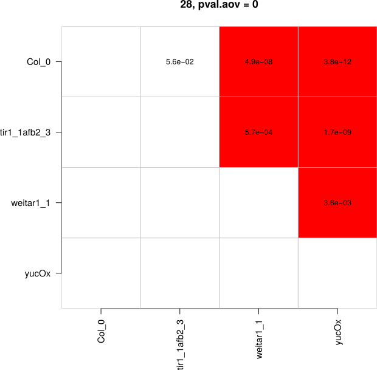

```{r, include = FALSE}
knitr::opts_chunk$set(
  collapse = TRUE,
  comment = "#>", 
  fig.width=6, 
  fig.height=6
)
```

Detailed manual for `rootdetectR 0.1.0`

# Table of Contents
1. [Introduction](#introduction)
2. [Installation](#installation)
3. [Process Data](#data-processing)
4. [Conduct Statistical Tests](#statistics)
5. [Plots](#plot-data)
6. [Additional Features](#additional-features)
7. [Future Features](#future-features)

# Introduction

[RootDetection](http://www.labutils.de/) is an automated tool for evaluating photographs of plant roots. It detects single strand roots, traces their paths and measures the resulting lengths - completely automatic. It can also be used to measure hypocotyl, petiole length and other parameters by hand. All results are written to an embedded database and can be exported as *.csv files.

The `rootdetectR` package provides useful functions in R to analyze the *.csv output from Rootdetection. With the provided functions it is possible to conduct all necessary data processing (e.g. normalize data according to length standard, compute relative data) and statistical test (e.g. summary statistics, test for normal distribution, different types of ANOVA analysis). Additionally it is possible to produce publication ready data representation (box or jitter plots containing statistic information) with the provided functions. This vignette is showing the workflow for standard statistical analysis and data representation with `rootdetectR`. The methods implemented in this package were previously used for multiple publications (e.g. [Bellstaedt et. al 2019](https://www.plantphysiol.org/content/180/2/757); [Ibañez et. al 2018](https://www.sciencedirect.com/science/article/pii/S0960982217316020) ) .

To illustrate the standard analysis pipeline an example data set called `root_output` (short for standard Rootdetection output) is included in the package. If you call `root_output` you will find a data set containing measured _Arabidopsis thaliana_ wild-type (Col-0) and mutant (tir1_1afb2_3, weitar1_1, yucOx) seedling roots at 20°C (hereafter also called control) and 28°C (hereafter also called treatment). Plants were grown on ATS plates for 4 days at 20°C and then stayed at 20°C or were shifted to 28°C. The columns labeled with '10mm' contains the length standard in column LengthPx (measured 10mm of a ruler for several times with exact the same camera settings than for the rest of the pictures).

The `rootdetectR` package comes with another dataset for some more complex analysis. The dataset called `root_output_multfac2` consists of root measurments of _A. thaliana_ plants (2 wildtype strains and 2 mutants) grown under 3 different conditions on ATS plates: 8 days under 20°C, 8 days under 28°C and a shift experiment with 4 days 20°C and subsequently 4 days under 28°C. The length standard of this experiment is labled with '20mm' and describes standard measurments of 20mm.

<br>

# Installation

Make sure you have the latest version of R and RStudio.

__Caution:__ Windows user will need to install [RTools](cran.r-project.org/bin/windows/Rtools/) to be able to build the package.

To build the vignette (this detailed manual) on you computer you will need to install the packages knitr and rmarkdown.

```r
install.packages(c('knitr', 'rmarkdown'))
```

To install rootdetectR from github the package devtools is required. 

```r
# devtools needs to be available to download packages from github
if('devtools' %in% rownames(installed.packages()) == FALSE) {install.packages('devtools')}
library('devtools')
```

After installing all prerequisites you can install `rootdetectR` from github.

```r
#install from github
install_github("PhilippJanitza/rootdetectR", build_vignettes = TRUE)
```

After the installation the package can be loaded within R.

```{r setup}
library(rootdetectR)
```

To view the vignette in R type:

```r
vignette('Introduction', package = 'rootdetectR')
```

# Data Processing

## Check Data
The package comes with an example data set to illustrates the structure of an *.csv output file from Rootdetection. Make sure your data set is matching all the criteria needed for the package.

```{r}
# load example data set stored in rootdetectR
data("root_output")

# show an example Rootdetection output
head(root_output)
```

To test if your Rootdetection Output has the right format you can use the function `is_rootdetection_output`. Several conditions must be fulfilled to be a data set that can be handled by `rootdetectR`. The data must be in a data.frame containing at least following columns: Label, LenghtPx and LengthMM. The column names must be exactly the same as in the example (check cases). The column LengthPx must contain numerical values and the 10mm Label must be present to calculate the length values in mm (LengthMM).

```{r}
# this input dataset follows all the standards
is.root_detection_output(root_output)

```

The function returns a logical variable. If R prints TRUE your input data set follows all the Rootdetection Output standards.


## Calculate LengthMM according to 10mm standard

In standard Rootdetection Assays you should include some standard measurements defined by the label 10mm. The function `norm_10mm_standard` is using the LengthPx values from the label '10mm' to calculate a length standard. This standard is used to calculate LengthMM for all lines and afterwards the 10mm standard is deleted from the data table. In addition the label is split into Factor1 and Factor2 by `label_delim`. This normalization and spliting procedure must be done with every assay since camera focus and settings will change between different experiments. For all following functions you will need the output (Normalized Rootdetection Output) from this function.

```{r}
# calculate LengthMM for all lines
root_norm <- norm_10mm_standard(root_output, label_delim = ';')

head(root_norm)
```


## Calculate LengthMM according to customized standard

If you want to add a customized length standard (different from 10mm standard described above) you can use the function `norm_cust_standard`. In addition to the function `norm_10mm_standard` you are able to change the label and the mm length described by this satndard measurements. Here the dataset `root_norm_multfac2` is used to illustrate this function.

```{r}
# calculate LengthMM for all lines
root_norm_multfac2 <- norm_cust_standard(root_output_multfac2, label_delim = ';', label_standard = '20mm', standard_length_mm = '20')

head(root_norm_multfac2)
```

## Calculate Relative Data

Relative data describes the change between control and treatment of Factor2. For each line (Factor1) the treatment values are set in relation to the median of the control. First for each line (Factor1) the median of the control (20°C) measurements is calculated. This median is then used to calculate values of the treatment (28°C) relative to the control (20°C) median by this formula: 
<br><br>

$relativevalue = \displaystyle \frac{100 * treatmentvalue}{control median}$

<br>
The function `rel_data` returns a data.frame containing relative values for each line and each treatment (control values are not present anymore!).

```{r}
rel_table <- rel_data(root_norm, control = '20')
head(rel_table)
```


# Statistics

## Calculating Summary Statistics

To get an overview of the data it is good to check some general statistical parameters. The function `summary_stat` calculates sample size (n), median, mean, standard deviation (sd) and standard error (se) for all lines present in the Normalized Rootdetection Output.

```{r}
# calculate summary statistic for each line
sum_s <- summary_stat(root_norm)
sum_s
```

## Test for normality

Like other parametric tests, the analysis of variance (ANOVA) assumes that the data fit a normal distribution. If your measurement variable is not normally distributed, you may increase the chance of false positive results if you analyze the data with an ANOVA or other parametric tests. Therefore the `rootdetectR` package contains a function to test if the measurments of all lines under each condition are normally distributed. The `normality_test` function takes a Normalized Rootdetection Output data.frame as input and conducts a Shapiro-Wilk test of normality for each line (Factor1) under each condition (Factor2). The function returns a data.frame containing p-values. The null-hypothesis of this test is that the population is normally distributed. If the p value is less than 0.05 (alpha level), then the null hypothesis is rejected and there is evidence that the data is not normally distributed. If the p value is greater than 0.05 the null hypothesis that the data came from a normally distributed population can not be rejected. (p < 0.05 --> evidence that not normally distributed | p > 0.05 --> evidence that normally distributed)

```{r}
check_norm <- normality_test(root_norm)
check_norm
```

In addition `rootdetectR` has a function called `plot_hist`. This function produces histogram plots for each line (Factor1) and condition (Factor2) containing the values from this group wise Shapiro-Wilk test. For more information on this check the [Plots](#plot-data) section.


## One-Way ANOVA
The are different kinds of ANOVA (Analysis of Variance) implemented in `rootdetectR` to have useful tools to reassess different comparisons of your data set. A good starting point is to conduct One-Way ANOVA analysis for Factor1 and Factor2 to check if there are differences within this factors. `rootdetectR` comes with two functions (`onefacaov_fac1` and `onefacaov_fac2`) to do this kind of analysis. The output is a matrix or a list of matrices with p-values from Tukey post-hoc test.

`onefacaov_fac1` compares all Factor1 within each Factor2. For every Factor2 a One-Way ANOVA is conducted over all measurements for each Factor1. Subsequently a Tukey post-hoc test is done and the p-values are returned. For the example data you will retrieve a list of two data.frames - one for each Factor2 condition (one for 20°C and one for 28°C). In addition to the list of matrices output you can use the function to produce a *.pdf output of each matrix a plot with p-values is produced (comparisons in red have a p-value < 0.5 and are defined as significant). 

```{r}
# draw_out = F produces only a list of matrices containing p-values from Tukey post-hoc test 
ow_anova_factor1 <- onefacaov_fac1(root_norm, draw_out = F)
ow_anova_factor1
```
<br>
The `file_base` argument is necessary if `draw_out = T`. It is used to get the path and the base for the file name (e.g. /your/path/filebasename). Two *.pdf files were produced in this example case as we have two Factor2 levels. The functions adds the level of Factor2 automatically to the file names. In this example case the file names will be 1fac_ANOVA_factor1_20.pdf and 1fac_ANOVA_factor1_28.pdf.
```r
# draw_out = T produces a list of matrices containing p-values from Tukey post-hoc test 
# in addition pdf files with basename 1fac_ANOVA_factor1 are produced in your working dir
ow_anova_factor1 <- onefacaov_fac1(root_norm, draw_out = T, file_base = '1fac_ANOVA_factor1')
# the argument p_value_size changes the sizes of the plotted p-value
ow_anova_factor1 <- onefacaov_fac1(root_norm, draw_out = T, file_base = '1fac_ANOVA_factor1', 
                                   p_value_size = 0.8)
```
<br><br>
<center>

<br>
<p style="font-size:12px;">1fac_ANOVA_factor1_20.pdf</p>

<br><br>

<br>
<p style="font-size:12px;">1fac_ANOVA_factor1_28.pdf</p>
<br><br>
</center>
`onefacaov_fac2` compares Factor2 control (20°C) to each Factor2 treatment (in this example there is only one treatment - 28°C) for each Factor1. For each Factor1 a One-Way ANOVA is conducted for each Factor2 control (20°C) Factor2 treatment (28°C) combination. This function will return matrices for each Factor2 control Factor2 treatment combination. In addition to the list of matrices you can use the function to produce a *.pdf output of each matrix containing a plot with p-values from Tukey post-hoc test (comparisons in red have a p-value < 0.5 and are defined as significant). 

```{r}
# draw_out = F produces a list of matrices containing p-values from Tukey post-hoc test
# in addition you need to tell the function the name of the control
# make sure that the control value is exactly the same as in column Factor2
ow_anova_factor2 <- onefacaov_fac2(root_norm, control = '20', draw_out = F)
ow_anova_factor2
```
<br>

The `file_base` argument is necessary if `draw_out = T`. It is used to get the path and the base for the file name (e.g. /your/path/filebasename). In this example case there is only one treatment condition (28°C) so a single *.pdf file (1fac_ANOVA_factor2_28.pdf) is created.

```r
# draw_out = T produces a list of data.frames containing p-values from Tukey post-hoc test
# in addition pdf files with basename 1fac_ANOVA_factor1 are produced in your working dir
ow_anova_factor2 <- onefacaov_fac2(root_norm, control = '20', draw_out = T, 
                                   file_base = '1fac_ANOVA_factor2')
# the argument p_value_size changes the sizes of the plotted p-value
ow_anova_factor2 <- onefacaov_fac2(root_norm, control = '20', draw_out = T, 
                                   file_base = '1fac_ANOVA_factor2', p_value_size = 0.8)
```
<br><br>
<center>

<br>
<p style="font-size:12px;">1fac_ANOVA_factor2_28.pdf</p>
<br><br>
</center>

## Two-Way ANOVA

To compare all lines and all conditions among each other a Two-Way ANOVA is a suitable statistical analysis. The function `twofacaov` implemented in `rootdetectR` is able to compare all lines from a Normalized Rootdetection Output by a Two-Way ANOVA and a Tukey post-hoc test. The function will return a matrix containing p-values for all comparisons. Values obtained from this analysis are used as input to print statistics in plots of the absolute data (`abs_plot` function). For more information check the [Plots](#plot-data) section.

```{r}
# draw_out = F produces a matrix containing p-values from Tukey post-hoc test
# label_delim defines how Factor1 and Factor 2 are splitted in column Label

tw_anova <- twofacaov(root_norm, label_delim = ';', draw_out = F)
tw_anova
```
<br>
The `file` argument is necessary if `draw_out = T` is used to have a path and the file name.( __Caution:__ For this function you have to type the whole file name (ending with '.pdf') and not just a base name) In the following example a *.pdf file with the name 2fac_ANOVA_all_vs_all.pdf is printed.

```r
# draw_out = T produces a matrix containing p-values from Tukey post-hoc test
# in addition pdf files with basename 1fac_ANOVA_factor1 are produced in the working dir
tw_anova <- twofacaov(root_norm, label_delim = ';', draw_out = T, 
                                   file = '2fac_ANOVA_all_vs_all.pdf')
# the argument p_value_size changes the sizes of the plotted p-value
tw_anova <- twofacaov(root_norm, label_delim = ';', draw_out = T, 
                                   file = '2fac_ANOVA_all_vs_all.pdf',
                                   p_value_size = 0.8)
```

<br><br>
<center>

<br>
<p style="font-size:12px;">2fac_ANOVA_all_vs_all.pdf</p>
<br><br>
</center>

## pairwise Two-Way ANOVA of treatment responses 

To compare the change from control Factor2 (here 20°C) to each treatment Factor2 (here only 28°C) for each Factor1 (line) a pairwise Two-Way ANOVA is conducted. Afterwards a Tukey post-hoc test is done and p-values are adjusted for multiple testing by Benjamini-Hochberg correction. For each Factor2 control Factor2 treatment a matrix containing p-values is returned. The adjusted p-values from this analysis are used to print statistics in the relative plots (`plot_rel` function). For more information check the [Plots](#plot-data) section.

```{r}
# draw_out = F produces a matrix containing p-values from Tukey post-hoc test
# label_delim defines how Factor1 and Factor 2 are splitted in column Label
# in addition you need to tell the function the name of the control
pairwise_tw_anova <- pairwise_2facaov(root_norm, control = "20", label_delim = ';', 
                                      draw_out = F)
pairwise_tw_anova
```
<br>
The `file_base` argument is necessary if `draw_out = T` is used to have a path and the base for the file name. For each Factor2 control (20°C) Factor2 treatment (28°C) pair a *.pdf file is created.

```r
# draw_out = F produces a matrix containing p-values from Tukey post-hoc test
#
#
# label_delim defines how Factor1 and Factor 2 are splitted in column Label
# in addition you need to tell the function the name of the control
pairwise_tw_anova <- pairwise_2facaov(root_norm, control = "20", label_delim = ';', 
                                      draw_out = T, file_base = '2fac_ANOVA_BH_corrected')
# the argument p_value_size changes the sizes of the plotted p-value
pairwise_tw_anova <- pairwise_2facaov(root_norm, control = "20", label_delim = ';', 
                                      draw_out = T, file_base = '2fac_ANOVA_BH_corrected'
                                      p_value_size = 0.8)
```
<br><br>
<center>

<br>
<p style="font-size:12px;">2fac_ANOVA_BH_corrected_20_vs_28.pdf</p>
<br><br>
</center>

# Plot data

To visualize the data obtained from Rootdetection the `rootdetectR` package comes with several plot features to produce publication ready data visualization using the `ggplot2` package. The plot functions of `rootdetectR` are also able to illustrate significance among several lines within the plot using a Letter code. 

## Histogram plots

To visualize the distribution of the data the function `plot_hist` will produce an histogram for each line, show the p-values of a Shapiro-Wilk test and adds color encoding (green - likely normally distributed | red - likely not normally distributed) to the plot.

The function will produce a list of plots containing a histogram for each line.

```{r}
# this will produce a list of plots
histograms <- plot_hist(root_norm, draw_out = F)
# For each line under each condition a plot will be produced 
length(histograms)
# you can acess e.g. the first plot by typing:
histograms[[1]]
```

In addition you can print the plots in a single *.pdf file by setting `draw_out = T` and choose a path and a file name with the `file` argument. This will print out up to 12 plots per page.

```r
plot_hist(root_norm, draw_out = T, file = 'data_distribution.pdf')
```
<br><br>
<center>

<br>
<p style="font-size:12px;">histograms.pdf</p>
</center>

## Plot absolute data

To visualize the absolute data there is the function `plot_abs` implemented in `rootdetectR`. This function will produce a box or jitter plot containing measurments of each line (Factor1) under each condition (Factor2) using `ggplot2`. There are some features (arguments) to customize the plots to your needs. For more information on customization of legend elements, axes elements, plotting of sample size, letter elements etc. just check out the man file by typing `?plot_abs` after loading the package. 

```{r}
# plot absolute data as boxplot
absolute_plot <- plot_abs(root_norm, plot_significance = F, label_delim = ';', type = 'box')
absolute_plot
```
```{r}
# plot absolute data as combination of boxplot and jitterplot
absolute_plot <- plot_abs(root_norm, plot_significance = F, label_delim = ';', type = 'jitter')
absolute_plot
```

It is possible to change the color of the box or jitter plot by using the argument `plot_colours`. To change the colors you have to add a vector with colors (`ggplot2` colors or hex colors) matching the same length than Factor2 factors. To find out more about using colors in `ggplot2` check: 
[sape Homepage](https://www.sape.inf.usi.ch/quick-reference/ggplot2/colour) If you don't add a vector with colors the function will use the standard `ggplot2` colors. 

```{r}
# first check the quantity of Factor2 conditions
length(unique(root_norm$Factor2))
# add a vector with two colours to your data
absolute_plot <- plot_abs(root_norm, plot_significance = F, label_delim = ';', type = 'jitter', 
                          plot_colours = c('blue', 'red'))
absolute_plot
```

With `rootdetectR` it is possible to add statistics from the `twofacaov` function to this plots using Letter encoding. If `plot_significance` is set to TRUE you have to add the `twofacaov` output in the function.

```{r}
# calculate ANOVA and Tukey post-hoc for your data with Two-Way ANOVA
tw_anova <- twofacaov(root_norm, draw_out = F)
# use the twofacaov output in the plotting function to plot statistics
absolute_plot <- plot_abs(root_norm, plot_significance = T, twofacov_output = tw_anova, 
                          label_delim = ';', type = 'jitter', plot_colours = c('blue', 'red'))
absolute_plot
```

As you can see in the output it seems like the letters are sticking directly onto the highest data point. You can adjust this by using the argument `letter_height`. By default it is set to 2. This means the Letters will be added 2 'x-values' above the highest data point. For this data set we need to increase the letter height.

```{r}
# increase letter heigth
absolute_plot <- plot_abs(root_norm, plot_significance = T, twofacov_output = tw_anova, 
                          label_delim = ';', type = 'jitter', plot_colours = c('blue', 'red'), 
                          letter_height = 5)
absolute_plot
```

## Plot relative data

Analogous to the plots of the absolute date `rootdetectR` comes with a function to plot relative data called `plot_rel`. For this function it is also possible to plot letter encoded statistics by setting `plot_significance` to TRUE. For the relative data you need to provide the output from the `pairwise_2facaov` function. Since the `pairwise_2facaov` is only capable to compare relative data for each Factor2 control Factor2 treatment pair you will obtain multiple plots if you have more than one Factor2 treatments (more than two Factor2 in general). (If you have multiple Factor2 treatments and set plot_significance = F you will get all the data in one plot without statistics.)

_Caution: The input data set is the Normalized Root Output and not the table with relative data._ The relative data is calculated within the function

```{r}
# plot relative data
relative_plot <- plot_rel(root_norm, plot_significance = F, type = 'jitter', control = '20')
relative_plot
```

To add statistics to this plot set `plot_significance = T` and add the output from the `pairwise_2facaoc`.

```{r}
# plot relative data
pairwise_tw_anova <- pairwise_2facaov(root_norm, control = '20', label_delim = ';', draw_out = F)
relative_plot <- plot_rel(root_norm, plot_significance = T, 
                          pairwise_2facaov = pairwise_tw_anova, 
                          type = 'jitter', control = '20', letter_height = 10)
relative_plot
```

The paragraph illustrates the behaviour of the `plot_rel` function if you have a dataset containing multiple Factor2 treatment levels. Therefore the dataset `root_output_multfac2` is used in the next examples.

```{r}
# first we need to normalize the dataset with length standard 
# (Caution: customized length standard used)
root_norm_multfac2 <- norm_cust_standard(root_output_multfac2, label_delim = ';', 
                                         label_standard = '20mm', standard_length_mm = '20')

# plot relative data with multiple factor2 treatment levels without statistics
relative_plot_multfac2 <- plot_rel(root_norm_multfac2, plot_significance = F, 
                          type = 'jitter', control = '20', letter_height = 10)
relative_plot_multfac2 
```

Although we have multiple Factor2 treatment levels in this example all the data is plotted together as long as we use `plot_significance = F`. If you want to plot relative data of single Factor2 treatments without statistics you need to subset your data using the `subset_fac2()` function described in the section [Additional Features](#additional-features).

```{r}
# first we need to normalize the dataset with length standard 
# (Caution: customized length standard used)
root_norm_multfac2 <- norm_cust_standard(root_output_multfac2, label_delim = ';', 
                                         label_standard = '20mm', standard_length_mm = '20')

# condcut the pairwise two way anova of the root_norm_multfac2 dataset
pairwise_tw_anova_multfac2 <- pairwise_2facaov(root_norm_multfac2, control = '20', 
                                               label_delim = ';', draw_out = F)

# plot relative data with multiple factor2 treatment levels with statistics
relative_plot_multfac2 <- plot_rel(root_norm_multfac2, plot_significance = T,
                                   pairwise_2facaov_output = pairwise_tw_anova_multfac2,
                                   type = 'jitter', control = '20', letter_height = 10)
# calling the variable will show us that there is a list with two plots
relative_plot_multfac2 
```
<br>
As we have two Factor2 treatments there are two plots are produced with `plot_rel` and `plot_significance = T`.

There are some additional features (arguments) to customize the plots to your needs. For more information on customization of legend elements, axes elements, plotting of sample size, letter elements, coloring etc. just check out the man file by typing `?plot_rel` after loading the package. 

# Additional Features

The package `rootdetectR` comes with a number of additional useful functions to work with Rootdetection Outputs and other physiological measurements. 

## Calculate Standard Error

The R base do not contain a function to calculate standard error. Therfore `rootdetectR` has the function `se` impelemented to calculate the standard error of a numeric vector. The function `se` is used in `summary_stat`.

```{r}
# get measurments for a single line and condition from Normalized Root Detection Output
# for this example we use root measurements Col-0 grown at 20°C
col0_20_measurments <- root_norm[root_norm$Label == 'Col_0;20',]$LengthMM
# calculate Standard Error
se(col0_20_measurments)
```

## Remove Outlier

Sometimes outliers indicate a mistake in data collection and can influence the statistical power of a data set. In general it is not a good practice to delete outlier from your data but form time to time you might want to check the influence of outlier. Therfore the functions `rm_outliers` and `rm_outliers_df` are added to `rootdetectR`. Within in this functions outlier are defined as data points with more than 1.5 * IQR (interquartile range) from 75th and 25th percentiles. (defined as outlier are data points (x) from a numeric vector that are: x < Q1 - 1.5 * IQR and x > Q3 + 1.5 * IQR)

Here is an example to explain the outlier detection in `rootdetectR`:
```{r}
# x is just an example vector
x <- c(82, 99, 100, 101, 103, 109, 110, 129)

# calculate and show quantiles
quantile(x)

# calculate 1.5 * IQR and store in variable
x_iqr <- (IQR(x, na.rm = T) * 1.5)
x_iqr

# calculate lower end Q1 - 1.5 * IQR
quantile(x, 0.25) - x_iqr 
# calculate upper end Q3 + 1.5 * IQR
quantile(x, 0.75) + x_iqr 

# so the first (82) and last (129) datapoint of x should be removed
```
<br>
Here we calculated the upper and lower border of the 1.5 * IQR and could remove the first and last data point of x by hand. The function `rm_outlier` can do this procedure for you.

```{r}
# you can use the rm_outlier function for this
rm_outlier(x)

# in addition you can convert the outlier to NA values to illustrate the position in your vector
# Caution: all NAs that were present in your dataset befor will automatically deleted
rm_outlier(x, fill_na = T)
```
<br>
If you want to remove outliers from a complete Normalized Rootdetection Output you can use the function `rm_outlier_df` to delete all outliers from the data set.
```{r}
# you can use the rm_outlier_df function to delete all outliers from Normalized Rootdetection Output
head(rm_outlier_df(root_norm))

# you can convert the outlier to NA values to illustrate the positions in your data set
# Caution: all NAs that were present in your dataset befor will automatically deleted
head(rm_outlier_df(root_norm, fill_na = T))
```
<br>
## Create Subsets of Rootdetection Outputs by Factor2

Experiments with a lot of different conditions are quite common in biological Assays. In such assays there is often a control condition and different treatments (both Factor2) applied to a variety on lines (Factor1). Some times these very big data sets are hard to handle and plots will become quite messy. Therefore `rootdetectR` has implemented the function `subset_fac2`. This function will create subsets for each Factor2 control and treatment pair.

__Caution: If there is only a single treatment condition this type of subsetting does not make any sense and the function will print an error message.__
```{r}
# We can use the root_output_multfac2 dataset to subset our data
# this will produce a subset for eacht Factor2 control treatment pair
list_of_subsets <- subset_fac2(root_norm_multfac2, control = '20')

# this will produce a list of data.frames with the length of our control treatment pairs
# the names of the list elements correspond to Factor2 treatment name
head(list_of_subsets$`20_and_28`)
head(list_of_subsets$`20_and_20_28`)

```
<br>
## Use of colorblind friendly colors

About 8% of all males and 0.5% of all females have a color vision deficiency. This is a decreased ability to see colors or differences in colors. Therfore it is important to make sure that all readers of your publications (or all people in the audience) can detect the different colors in your plots. With `colors_wong` you can find a string containing 7 colors in hex-format optimized for colorblind individuals. The colors were proposed by Wong in following puclication: [Wong, B. (2011). Points of view: Color blindness. Nature Methods, 8(6), 441–441.](https://www.nature.com/articles/nmeth.1618)

`rootdetectR` comes with the function `show_colors` to visualize colours stored in a string. 

```{r}
# colors_wong is a variable storing a string with hex-codes for 7 colourblind friendly 
colors_wong

# to visualize the colours there is a function called show_colors
# this will plot all colours within in the strin colors_wong
show_colors(colors_wong)

# it is also possible to create strings with R colornames
example_colors <- c('red', 'blue', 'palegreen', 'yellow3')
show_colors(example_colors)
```

## Extract colors from a picture

With the `extract_colors` function it is possible to extract the most prominent colors of a given picture. Therefore picture must be present in a raster array object. To read in picture files in the right fromat you can use the `readJPEG` or `readPNG` function from the `jpeg` or `png` package. As an example there is a raster array object included. `primroses` stors a picture of prim roses from [Wikimedia commons](https://upload.wikimedia.org/wikipedia/commons/thumb/6/6f/Primeln_bunte_Farbenpracht.JPG/1024px-Primeln_bunte_Farbenpracht.JPG). With the function `extract_colors` it is possible to obtain the most prominent colors of the picture by k-means clustering. By setting `n` you define how many colors you want to obtain from the picture (default = 6).

```{r}
# to be able to plot a picture you will need to load the grid package
library(grid)

grid.raster(primroses)
```
```{r}
# extract the 6 most prominent colors and store into a string
prim_colors <- extract_colors(primroses, n =6)
# it is also possible to show the picture containing only the 6 extracted colors
# therefore you must set plot_out = T
prim_colors <- extract_colors(primroses, n =6, plot_out = T)
# you can then use show_colors to plot the extracted colors
show_colors(prim_colors)
```

# Future Features

In future versions several features will be implemented:

1. Function to check if data.set is already normalized by a length standard
2. Function to remove NA and LengthPx = 0 from data.set
3. Add alternative normality tests to `plot_hist` and `check_norm` functions
4. Add internal testing to the package
5. add options of sorting plots - using forcats package?

If you have any suggestions or questions please drop an e-mail to [philipp.janitza@landw.uni-halle.de](mailto:philipp.janitza@landw.uni-halle.de) .

