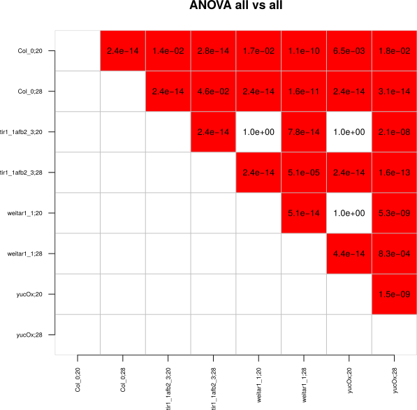

```{r, include = FALSE}
knitr::opts_chunk$set(
  collapse = TRUE,
  comment = "#>", 
  fig.width=6, 
  fig.height=6
)
```

# Table of Contents
1. [Introduction](#introduction)
2. [Installation](#installation)
3. [Process Data](#data-processing)
4. [Conduct Statistical Tests](#statistics)
5. [Plots](#plot-data)
6. [Future Features](#future-features)

# Introduction

[RootDetection](http://www.labutils.de/) is an automated tool for evaluating photographs of plant roots. It detects single strand roots, traces their paths and measures the resulting lengths - completely automatic. It can also be used to measure hypocotyl, petiol length and other parameters by hand. All results are written to an embedded database and can be exported as CSV files.

The `rootdetectR` package provides useful functions in R to analyze the *.csv output from Rootdetection. With the provided functions it is possible to conduct all necessary data processing (e.g. normalize data according to length standard, compute relative data) and statistical test (e.g. summary statistics, test for normal distribution, different types of ANOVA analysis). Additionally it is possible to produce publication ready data representation (box or jitter plois containing statistic information) with the provided functions. This vignette is showing the workflow for standard statistical analysis and data representation with `rootdetectR`. The methods implemented in this package were previously used for multiple publications (e.g. [Bellstaedt et. al 2019](https://www.plantphysiol.org/content/180/2/757); [Ibañez et. al 208](https://www.cell.com/current-biology/fulltext/S0960-9822(17)31602-0) ) .

To illustrate the standard analysis pipeline an example dataset called `root_output` (short for standard rootdetection output) is included in the package. If you call `root_output` you will find a dataset containing measured _Arabidopsis thaliana_ wild-type (Col-0) and mutant (tir1_1afb2_3, weitar1_1, yucOx) seedling roots at 20°C (hereafter also called control) and 28°C (hereafter also called treatment). Plants were grown on ATS plates for 4 days at 20°C and then stayed at 20°C or were shifted to 28°C. The columns labeled with '10mm' contains the length standard in colum LengthPx (measured 10mm of the ruler for several times with exact the same camera settings than for the rest of the photos).

<br>

# Installation

Users can download `rootdetectR` from my [GitHub repository](https://github.com/PhilippJanitza) :

```r
# devtools needs to be available to download packages from github
if('devtools' %in% rownames(installed.packages()) == FALSE) {install.packages('devtools')}
library('devtools')

#install from github
install_github('xxxxx_needs_to_be_added_xxxx')
```

After the installation the package can be loaded within R.

```{r setup}
library(rootdetectR)
```

# Data Processing

## Check Data
The following code illustrates an example structure of an `Rootdetection Output`.

```{r}
# load example data set stored in rootdetectR
data("root_output")

# show an example Rootdetection output
head(root_output)
```

You can test if the Rootdetection Output has the right format with the function `is_rootdetection_output`. Several conditions must be fulfilled to be a dataset that can be handeled by `rootdetectR`. The data must be in a data.frame containing at least following columns: Label, LenghtPx and LengthMM. The column names must be exactly the same as in the example (check cases). The column LengthPx must contain numerical values and the 10mm Label must be present to calculate the right LengthMM.

```{r}
# this input dataset follows all the standards
is.root_detection_output(root_output)

```

Function returns a logical variable. If TRUE your input dataset meets all the Rootdetection Output standards.


## Calculate LengthMM according to 10mm standard

In standard Rootdetection Assays you should include some standard measurements defined by the label 10mm. The function `norm_10mm_standard` is using the LengthPx values from the label 10mm to calculate a length standard. Subsequenctly this standard is use to calculate LengthMM for all lines and the 10mm standard is deleted from the table. An addition the label is splitted into Factor1 and Factor2 by `label_delim`. This normalization procedure must be done with every assay since camera focus and settings will change between different experiments. For all following functions you will need the oputput (Normalized Rootdetection Output) from this function.

```{r}
# calculate LengthMM for all lines
root_norm <- norm_10mm_standard(root_output, label_delim = ';')

head(root_norm)
```

## Calculating Summary Statistics

To get an overview of the data it is good to check some statistical parameters. The function `summary_stat` calculates sample size (n), median, mean, standard deviation and standard error for all lines present in the Normalized Rootdetection Output.

```{r}
# calculate summary statistic for each line
sum_s <- summary_stat(root_norm)
sum_s
```

## Calculate Relative Data

Relative data describes the change between control and treatment of Factor2. For each line (Factor1) the treatment values are set in relation to the median of the control. First for each line (Factor1) the median of the control (20°C) measurements is calculated. This is then used to calculate values of the treatment (28°C) relative to the control (20°C) median by this formular: 
<br><br>

$relativevalue = \displaystyle \frac{100 * treatmentvalue}{control median}$

<br>
The function `rel_data` returns a data.frame containing relative values for each line and each treatment (control values are not present!).

```{r}
rel_table <- rel_data(root_norm, control = '20')
head(rel_table)
```


# Statistics

## Test for normality
Like other parametric tests, the analysis of variance assumes that the data fit the normal distribution. If your measurement variable is not normally distributed, you may be increasing your chance of a false positive result if you analyze the data with an ANOVA or other test that assumes normality. Therfore the `rootdetectR` package contains a function to test if all lines and each condition fits a normal distribution. The `normality_test` function takes a normalized Rootdetetion output data.frame as input and conducts a Shapiro-Wilk test of normality for each line and condition. The function returns a data.frame containing p-values. The null-hypothesis of this test is that the population is normally distributed. If the p value is less than 0.05 (alpha level), then the null hypothesis is rejected and there is evidence that the data is not normally distributed. If the p value is greater than 0.05 the null hypothesis that the data came from a normally distributed population can not be rejected. (p < 0.05 --> evidence that not normally distributed | p > 0.05 --> evidence that normally distributed)

```{r}
check_norm <- normality_test(root_norm)
check_norm
```

In addition `rootdetectR` has a function called `plot_hist`. This function produces histogram plots for each line (Factor1) and condition of Factor2 containing the values from this groupwise shapiro-wilk test. For more information on this check the [Plots](#plot-data) section.


## One-Way ANOVA
The are different kinds of ANOVA (Analysis of Variance) implemented in `rootdetectR` to have useful tools to reassess different comparisons of your dataset. A good starting point is to conduct One-Way ANOVA analysis for Factor1 and Factor2 to check if there are differences within this factors. `rootdetectR` comes with two functions (`onefacaov_fac1` and `onefacaov_fac2`) to do this kind of analysis. The output is a matrix or a list of matrices with p-values from Tukey post-hoc test.

`onefacaov_fac1` compares all Factor1 within each Factor2. For each Factor2 a One-Way ANOVA is conducted over all measurements for each Factor1. Subsequently a Tukey post-hoc test is done and the p-values are returned. For the example data you will retrieve a list of two data.frames - one for each Factor2 condition (one for 20°C and one for 28°C). In addition to the list of matrices output you can use the function to produce a *.pdf output of each matrix in the list containing a matrix with p-values (comparisons in red have a p-value < 0.5 and are defined as significant). 

```{r}
# draw_out = F produces a list of matrices containing p-values from Tukey post-hoc test 
ow_anova_factor1 <- onefacaov_fac1(root_norm, draw_out = F)
ow_anova_factor1
```
<br>
```r
# draw_out = T produces a list of matrices containing p-values from Tukey post-hoc test 
# in addition pdf files with basename 1fac_ANOVA_factor1 are produced in the working dir
ow_anova_factor1 <- onefacaov_fac1(root_norm, draw_out = T, file_base = '1fac_ANOVA_factor1')
```

The `file_base` argument is necessary if `draw_out = T` is used to have a path and the base for the file name. Two *.pdf files were produced in this example case as we have two Factor2 levels. The functions adds the level of Factor2 automitcally to the file names. In this example case the filenames will be 1fac_ANOVA_factor1_20.pdf and 1fac_ANOVA_factor1_28.pdf.
<br><br>
<center>

<br>
<p style="font-size:12px;">1fac_ANOVA_factor1_20.pdf</p>

<br><br>

<br>
<p style="font-size:12px;">1fac_ANOVA_factor1_28.pdf</p>
<br><br>
</center>
`onefacaov_fac2` compares Factor2 control (20°C) to each Factor2 treatment (in this example there is only one treatment - 28°C) for each Factor1. For each Factor1 a One-Way ANOVA is conducted for each Factor2 control (20°C) Factor2 treatment (28°C) combination. In addition to the list of matrices output you can use the function to produce a *.pdf output of each data.frame in the list containing a matrix with p-values from Tukey post-hoc test (comparisons in red have a p-value < 0.5 and are defined as significant). 

```{r}
# draw_out = F produces a list of matrices containing p-values from Tukey post-hoc test
# in addition you need to tell the function the name of the control
# make sure that the control value is exactly the same as in column Factor2
ow_anova_factor2 <- onefacaov_fac2(root_norm, control = '20', draw_out = F)
ow_anova_factor2
```
<br>
```r
# draw_out = T produces a list of data.frames containing p-values from Tukey post-hoc test
# in addition pdf files with basename 1fac_ANOVA_factor1 are produced in the working dir
ow_anova_factor2 <- onefacaov_fac2(root_norm, control = '20', draw_out = T, 
                                   file_base = '1fac_ANOVA_factor2')
```

The `file_base` argument is necessary if `draw_out = T` is used to have a path and the base for the file name. In this example case there is only one treatment condition (28°C) so only one *.pdf file (1fac_ANOVA_factor2_28.pdf) is created.
<br><br>
<center>

<br>
<p style="font-size:12px;">1fac_ANOVA_factor2_28.pdf</p>
<br><br>
</center>

## Two-Way ANOVA

To compare all lines and all conditions among each other a Two-Way ANOVA is suitable statistical analysis. The function `twofacaov` implemented in `rootdetectR` is able to compare all lines in a normalized Rootdetection output by this kind of ANOVA and a Tukey post-hoc test. As output it will print a matrix containing p-values for all comparisons. Values obtained from this analysis are used as input to print statistics in plots with the `abs_plot` function.

```{r}
# draw_out = F produces a matrix containing p-values from Tukey post-hoc test
# label_delim defines how Factor1 and Factor 2 are splitted in column Label

tw_anova <- twofacaov(root_norm, label_delim = ';', draw_out = F)
tw_anova
```
<br>
```r
# draw_out = T produces a matrix containing p-values from Tukey post-hoc test
# in addition pdf files with basename 1fac_ANOVA_factor1 are produced in the working dir
tw_anova <- twofacaov(root_norm, label_delim = ';', draw_out = T, 
                                   file = '2fac_ANOVA_all_vs_all.pdf')
tw_anova
```
The `file` argument is necessary if `draw_out = T` is used to have a path and the file name. In the following example a *.pdf file with the name 2fac_ANOVA_all_vs_all.pdf is printed.
<br><br>
<center>

<br>
<p style="font-size:12px;">2fac_ANOVA_all_vs_all.pdf</p>
<br><br>
</center>

## pairwise Two-Way ANOVA of treatment responses 
To compare the change from control Factor2 (20°C) to treatment Factor2 (28°C) for each Factor1 (line) pairwise Two-Way ANOVA are conducted. Afterwards a Tukey post-hoc test is conducted and p-values are adjusted for multiple testing by Benjamini-Hochberg correction. For each Factor2 control Factor2 treatment a matrix containing p-values is returned. The adjusted p-values from this analysis are used to print statistics in the relative plots.

```{r}
# draw_out = F produces a matrix containing p-values from Tukey post-hoc test
# label_delim defines how Factor1 and Factor 2 are splitted in column Label
# in addition you need to tell the function the name of the control
pairwise_tw_anova <- pairwise_2facaov(root_norm, control = "20", label_delim = ';', 
                                      draw_out = F)
pairwise_tw_anova
```
<br>
```r
# draw_out = F produces a matrix containing p-values from Tukey post-hoc test
#
#
# label_delim defines how Factor1 and Factor 2 are splitted in column Label
# in addition you need to tell the function the name of the control
pairwise_tw_anova <- pairwise_2facaov(root_norm, control = "20", label_delim = ';', 
                                      draw_out = T, file_base = '2fac_ANOVA_BH_corrected')
pairwise_tw_anova
```

The `file_base` argument is necessary if `draw_out = T` is used to have a path and the base for the file name. For each Factor2 control (20°C) Factor2 treatment (28°C) pair a *.pdf file is printed.
<br><br>
<center>

<br>
<p style="font-size:12px;">2fac_ANOVA_BH_corrected_20_vs_28.pdf</p>
<br><br>
</center>

# Plot data
To visulize the data from Rootdetection the `rootdetectR` package comes with several plot features to produce publication ready data visualization using the `ggplot2` package. The functions of `rootdetectR` are also able to illustrate significance among several lines within the plot using a Lettercode.
This first version of this pakage is only limited in customizability of the plots. The availability of more features is the main focus for future releases.

## Histogram plots
To visualize the distribution of the data the function `plot_hist` will produce an histogram for each line and shown the p-values of a Shapiro-Wilk test and add color encoding (green - normally distributed | red - not normally distributed) to the plot.

The function will produce a list of plots containing the histogram for each line.

```{r}
# this will produce a list of plots
histograms <- plot_hist(root_norm, draw_out = F)
# For each line a plot will be produced 
length(histograms)
# you can acess e.g. the first plot by typing:
histograms[[1]]
```

In addition you can print the plots in one *.pdf file by setting `draw_out` TRUE and choose with `file` argument a path and file name. This will print out up to 12 plots per pdf page.

```r
plot_hist(root_norm, draw_out = T, file = 'data_distribution.pdf')
```
<br><br>
<center>

<br>
<p style="font-size:12px;">histograms.pdf</p>
</center>

## Plot absolute data
To visualize the absolute data as boxplot or jitter-boxplot there is a function `plot_abs` implemented in `rootdetectR`. In this first version there are only a few possabilities to customize this plots - in later versions there will be more settings available. In this version it is possible to choose between box- or a mix of box- and jitter-plot. In addition it is possbile to print add statistics as Letters to the plot.

```{r}
# plot absolute data as boxplot
absolute_plot <- plot_abs(root_norm, plot_significance = F, label_delim = ';', type = 'box')
absolute_plot
```
```{r}
# plot absolute data as combination of boxplot and jitterplot
absolute_plot <- plot_abs(root_norm, plot_significance = F, label_delim = ';', type = 'jitter')
absolute_plot
```

In this version it is possbile to change the colour of the boxplot or the jitterplot by using the argument `plot_colours`. If you don't add any vector with colours the function will use the standard `ggplot2` colours. To change this you have to add an vector with colours (`ggplot2` colours or hex colours) matching the same length than Factor2 factors. To find out more about using colours in `ggplot2` check: 
[sape Homepage](https://www.sape.inf.usi.ch/quick-reference/ggplot2/colour) 

```{r}
# first check the quantity of Factor2 conditions
length(unique(root_norm$Factor2))
# add a vector with two colours to your data
absolute_plot <- plot_abs(root_norm, plot_significance = F, label_delim = ';', type = 'jitter', 
                          plot_colours = c('blue', 'red'))
absolute_plot
```

With `rootdetectR` it is possible to add statistics from the `twofacaov` function to this plots using Letter encoding. If `plot_significance` is set to TRUE you have to add the `twofacaov` output in the function.

```{r}
# calculate ANOVA and Tukey post-hoc for your data with tw_anova
tw_anova <- twofacaov(root_norm, draw_out = F)
# use this output in the plotting function to get Letter encoding in your plot
absolute_plot <- plot_abs(root_norm, plot_significance = T, twofacov_output = tw_anova, 
                          label_delim = ';', type = 'jitter', plot_colours = c('blue', 'red'))
absolute_plot
```

As you can see in the output it seems like the letters are sticking directly onto the highest data point. You can adjust this by using the argument `letter_height`. By default it is set to 2. This means the Letters will be added 2 x-values above the highest data point. For this data this seems to be not enough so we need to increase the letter heigth.

```{r}
# increase letter heigth
absolute_plot <- plot_abs(root_norm, plot_significance = T, twofacov_output = tw_anova, 
                          label_delim = ';', type = 'jitter', plot_colours = c('blue', 'red'), 
                          letter_height = 5)
absolute_plot
```


## Plot relative data
Analogous to the plots of the absolute date `rootdetectR` comes with a function tom plot relative data called `plot_rel`. For this function it is also possible to plot the letter encoded statistics by setting `plot_significance` to TRUE. For the relative data you need to provide the output from the `pairwise_2facaov` function. Since this ANOVA is only capable to compare relative data for one Factor2 control treatment pair you will obtain multiple plots if you have more than one Factor2 treatment (more than two Factor2 in general). (If you have multiple Factor2 treatments and set plot_significance = F you will get all the data in one plot without statistics.

_Caution: The input data set is the normalized root output and not the table with relative data_
The relative data is calculated within the function

```{r}
# plot absolute data
relative_plot <- plot_rel(root_norm, plot_significance = F, type = 'jitter', control = '20')
relative_plot
```

To add statistics to this plot `plot_significance` needs to be set to TRUE and the output from the `pairwise_2facaoc` is necessary.

```{r}
# plot absolute data
pairwise_tw_anova <- pairwise_2facaov(root_norm, control = '20', label_delim = ';', draw_out = F)
relative_plot <- plot_rel(root_norm, plot_significance = T, pairwise_2facaov = pairwise_tw_anova, 
                          type = 'jitter', control = '20', letter_height = 10)
relative_plot
```


# Future Features
In future versions several features will be implemented:

1. Rewrite `abs_plot` and `rel_plot` to get cleaner code
2. Add more customizability to `abs_plot` and `rel_plot`
3. Function to check if data.set is already normalized by a length standard
4. Function to remove outliers from dataset
5. Function to remove NA and LengthPx = 0 from data.set
6. Function to build subsets
7. Add alternative normality tests to `plot_hist` and `check_norm` functions
8. Add internal testing to the paackage

If you have any suggestions or questions please drop an e-mail to [philipp.janitza@landw.uni-halle.de](mailto:philipp.janitza@landw.uni-halle.de) .

