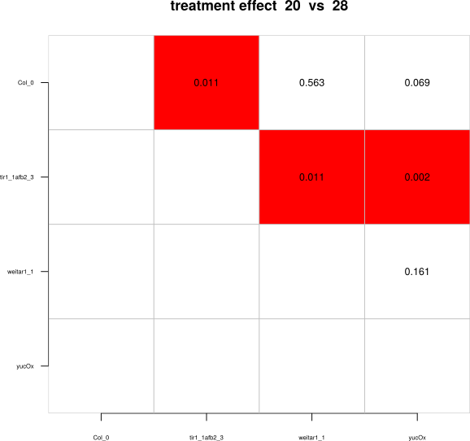

```{r, include = FALSE}
knitr::opts_chunk$set(
  collapse = TRUE,
  comment = "#>",
  fig.width=4, 
  fig.height=4
)
devtools::load_all(".")
```


# Installation

Make sure you have the latest version of R and R Studio installed.

First you need to install some perquisites:

```r
install.packages(c('knitr', 'rmarkdown', 'jpeg', 'png', 'devtools'))
```

After installing all prerequisites you can install `rootdetectR` from github using the devtools package.

```r
library(devtools)
# install from github
install_github("PhilippJanitza/rootdetectR", build_vignettes = TRUE)
```

After the installation the package can be loaded within R.

```r
library(rootdetectR)
```

# Introduction

This vignette describes how `rootdetectR` can be used to conduct analysis of physiological root or hypocotyl elongation assays. It was designed to work in companion with Rootdetection, an automated tool for evaluating photographs of plant roots. 
To be able to run this script the input data must fulfill some criteria (check the example data included in this script):

- The structure of the input table must be in long format and use standard column names 
- The delimiter within labels should be ';' - necessary if the analysis uses two factors e.g. genotype and treatment
- the data set must contain a length standard called '10mm' (multiple measuring of 1 cm)
- hyphens (-) in labels are not allowed!!


# Simple Data Analysis

First you will need to set the working directory and read in the data table (e.g. output from Rootdetection).

```r
# set your working directory and read in your data
setwd('/paht/to/your/workingdir')

# read in your rootdetection output table
my_dataset <- read.csv(file = '/path/to/rootdetection/output.csv')
```
First you can run the function `is_root_output()` to check if your dataset fulfills the minimum criteria to run all subsequent functions of `rootdetectR`. As measurings with Rootdetection

To start the analysis we need to normalize the dataset to a length standard.

```{r}
# In this example we will use an example data set included in rootdetectR
my_dataset <- root_output

# check input data
is_root_output(my_dataset)

# remove measurements with length 0
my_dataset <- my_dataset[!my_dataset$LengthPx == 0,]
# calculate LengthMM by length standard 10mm
my_dataset <- norm_10mm_standard(my_dataset)
# calculate relative data
my_dataset_rel <- rel_data(my_dataset, control = '20')
# calculate summary satistics
s_stat <-summary_stat(my_dataset)
# show summary statistics
s_stat
```

We will save all the created data as *.csv tables.

```r
# save the created tables to working dir
write.csv(my_dataset, file = 'absolute_data.csv')
write.csv(my_dataset_rel, file = 'relative_data.csv')
write.csv(s_stat, file = 'summary_statistics.csv')
```

Then we can check the data distribution and test for normality and save the output to a pdf file. (You can change the name by setting file = yourfilename.pdf as an argument to the function)
 
```r
plot_hist(my_dataset, draw_out = T)
```

<br>
<center>

<br>
<p style="font-size:12px;">histograms.pdf</p>
</center>

`rootdetectR` can perform several ANOVA + Tukey post-hoc analysis and print the p-values as matrix plots in pdf files. You can change the name of output pdfs by setting the arguments file or file_base.

```r
# One-way Anova over Factor1
ow_anova_factor1 <- onefacaov_fac1(my_dataset, draw_out = T)
```

<br>
<center>

<br>
<p style="font-size:12px;">1fac_ANOVA_factor1_20.pdf</p>
<br>

<br>
<p style="font-size:12px;">1fac_ANOVA_factor1_28.pdf</p>
<br><br>
</center>

```r
# One-way Anova over Factor2 control treatment combinations
ow_anova_factor2 <- onefacaov_fac2(my_dataset, control = '20', draw_out = T)
```

<br>
<center>

<br>
<p style="font-size:12px;">1fac_ANOVA_factor2_28.pdf</p>
<br><br>
</center>

```r
# Two-Way ANOVA all vs all
tw_anova <- twofacaov(my_dataset, label_delim = ';', draw_out = T)
```

<br>
<center>

<br>
<p style="font-size:12px;">2fac_ANOVA_all_vs_all.pdf</p>
<br><br>
</center>

```r
# Two-Way ANOVA of Interaction Effect
tw_anova_interaction <- interaction_twofacaov(my_dataset, label_delim = ';', 
                                              control = '20', draw_out = T)
```
<br><br>
<center>

<br>
<p style="font-size:12px;">2fac_ANOVA_BH_corrected_20_vs_28.pdf</p>
<br><br>
</center>

At least we will produce plots of absolute and relative data. Here only the standard plots are shown but there is a lot of customization possible. For more information check out the manual by typing ?plot_abs or ?plot_rel in your R console.

```{r}
# plot absolute data as jitter plot
absolute_plot <- plot_abs(my_dataset, plot_significance = T, label_delim = ';', 
                          height_letter = 5, plot_colours = c('cornflowerblue', 'indianred'))
absolute_plot
```
```r
# save absolute plot as pdf
pdf(absolute_plot.pdf)
absolute_plot
dev.off()
```

```{r}
# plot relative data as jitter plot
relative_plot <- plot_rel(my_dataset, plot_significance = T, 
                          control = '20', size_jitter_dot = 3)
relative_plot
```
```r
# save relative plot as pdf
pdf(relative_plot.pdf)
relative_plot
dev.off()
```
